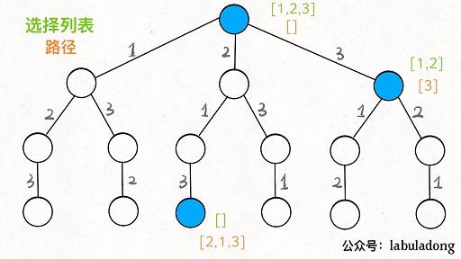

# 回溯法

常说的五大算法思维是指：**回溯法、贪心算法、分治法、动态规划和分支限界算法。**

## ✏ 1、回溯算法框架

**解决一个回溯问题，实际上就是一个决策树的遍历过程**。只需要思考 3 个问题：

1. 路径：也就是已经做出的选择。
2. 选择列表：也就是你当前可以做的选择。
3. 结束条件：也就是到达决策树底层，无法再做选择的条件。

回溯算法的框架：

```python
result = []
def backtrack(路径, 选择列表):
    if 满足结束条件:
        result.add(路径)
        return

    for 选择 in 选择列表:
        做选择
        backtrack(路径, 选择列表)
        撤销选择
```

**其核心就是 for 循环里面的递归，在递归调用之前「做选择」，在递归调用之后「撤销选择」**

### [全排列问题](https://leetcode-cn.com/problems/permutations/)

 给定一个 **没有重复** 数字的序列，返回其所有可能的全排列。

`n` 个不重复的数，全排列共有 $$n!$$ 个。该问题的解空间可以反映在下面的**「决策树」**上，以三个数 `[1,2,3]`为例：


加入此时站在上图的红色节点上做决策：**`[2]` 就是「路径」，记录你已经做过的选择；`[1,3]` 就是「选择列表」，表示你当前可以做出的选择；「结束条件」就是遍历到树的底层，在这里就是选择列表为空的时候**。

**可以把「路径」和「选择」列表作为决策树上每个节点的属性**，比如下图列出了几个节点的属性：



**前面定义的 `backtrack` 函数其实就像一个指针，在这棵树上游走，同时要正确维护每个节点的属性，每当走到树的底层，其「路径」就是一个全排列**。

各种搜索问题本质上都是树的遍历问题，而多叉树的遍历框架（递归）就是这样：

```cpp
void traverse(TreeNode root) {
    for (TreeNode child : root.childern)
        // 前序遍历需要的操作
        traverse(child);
        // 后序遍历需要的操作
}
```

**只要在递归之前做出选择，在递归之后撤销刚才的选择**，就能正确得到每个节点的选择列表和路径。代码如下：

```cpp
void backtrack(std::vector<std::vector<int>> &result, std::vector<int> &track, std::vector<int>& nums){
    if(track.size() == nums.size()){
        result.push_back(track);
        return;
    }
    for(int i : nums){
        if(std::find(track.begin(), track.end(), i) != track.end())
            continue;
        track.push_back(i);
        backtrack(result, track, nums);
        track.pop_back();
    }
}
vector<vector<int>> permute(vector<int>& nums) {
    std::vector<std::vector<int>> result;
    std::vector<int> track;
    backtrack(result, track, nums);
    return result;
}
```

这个算法解决全排列不是很高效，因为对链表使用 `find` 方法需要 `O(N)` 的时间复杂度。

必须说明的是，这道题不管怎么优化，都符合回溯框架，而且时间复杂度都不可能低于 $$O(n!)$$ ，因为穷举整棵决策树是无法避免的。**这也是回溯算法的一个特点，不像动态规划存在重叠子问题可以优化，回溯算法就是纯暴力穷举，复杂度一般都很高**。

## ✏ 2、题型

### \*\*\*\*[**Permutations II**](https://leetcode-cn.com/problems/permutations-ii/)\*\*\*\*

给定一个可包含重复数字的序列，返回所有不重复的全排列。

```cpp

```

### \*\*\*\*[**N-Queens**](https://leetcode-cn.com/problems/n-queens/)\*\*\*\*

 $$n$$ __皇后问题研究的是如何将 $$n$$ 个皇后放置在 $$n\times n$$ 的棋盘上，并且使皇后彼此之间不能相互攻击。

```cpp
bool isValid(std::vector<int> &solution, int col){
    int len = solution.size();
    // 在同一对角线上的剪枝
    for(int i = 0; i < len; ++i){
        if(std::abs(len - i) == std::abs(col - solution[i]))
            return false;
    }
    return true;
}

void backtrack_n(std::vector<std::vector<std::string>> &result, std::vector<int> &solution, std::vector<std::string> &cases, int n){
    if(n == solution.size()){
        std::vector<std::string> temp;
        for(int i : solution){
            temp.push_back(cases[i]);
        }
        result.push_back(temp);
        return;
    }
    for(int i = 0; i < n; ++i){
        // 同行同列剪枝
        if(std::find(solution.begin(), solution.end(), i) != solution.end())
            continue;
        if(isValid(solution, i)){
            solution.push_back(i);
            backtrack_n(result, solution, cases, n);
            solution.pop_back();
        }
    }
}

vector<vector<string>> solveNQueens(int n) {
    // 构建每行的结果集
    std::vector<std::string> cases;
    for(int i = 0; i < n; ++i){
        std::string str = std::string(i, '.') + 'Q' + std::string(n - i - 1, '.');
        cases.push_back(str);
    }
    std::vector<std::vector<std::string>> result;
    std::vector<int> track;
    backtrack_n(result, track, cases, n);
    return result;
}
```

### \*\*\*\*[**N-Queens II**](https://leetcode-cn.com/problems/n-queens-ii/)\*\*\*\*

 返回 _n_ 皇后不同的解决方案的数量。

```cpp
bool isValid(std::vector<int> &solution, int col){
    int len = solution.size();
    // 在同一对角线上的剪枝
    for(int i = 0; i < len; ++i){
        if(std::abs(len - i) == std::abs(col - solution[i]))
            return false;
    }
    return true;
}

void backtrack_n(int &result, std::vector<int> &solution, int n){
    if(n == solution.size()){
        result++;
        return;
    }
    for(int i = 0; i < n; ++i){
        // 同行同列剪枝
        if(std::find(solution.begin(), solution.end(), i) != solution.end())
            continue;
        if(isValid(solution, i)){
            solution.push_back(i);
            backtrack_n(result, solution, n);
            solution.pop_back();
        }
    }
}
int totalNQueens(int n) {
    int result = 0;
    std::vector<int> track;
    backtrack_n(result, track, n);
    return result;
}
```

### \*\*\*\*[**Sudoku Solver**](https://leetcode-cn.com/problems/sudoku-solver/)\*\*\*\*

```cpp

```

### [copy-list-with-random-pointer](https://leetcode-cn.com/problems/copy-list-with-random-pointer/)


## ✏ 3、回溯法与动态规划

回溯算法就是个多叉树的遍历问题，关键就是在前序遍历和后序遍历的位置做一些操作。**写 `backtrack` 函数时，需要维护走过的「路径」和当前可以做的「选择列表」，当触发「结束条件」时，将「路径」记入结果集**。

回溯算法和动态规划很像，动态规划的三个需要明确的点就是「状态」「选择」和「base case」，对应着回溯算法中的走过的「路径」，当前的「选择列表」和「结束条件」。某种程度上说，动态规划的暴力求解阶段就是回溯算法。只是有的问题具有重叠子问题性质，可以用 `dp table` 或者备忘录优化，将递归树大幅剪枝，这就变成了动态规划。

能采用动态规划求解的问题的一般要具有 3 个性质：

 （1）**最优化**：如果问题的最优解所包含的子问题的解也是最优的，就称该问题具有最优子结构，即满足最优化原理。子问题的局部最优将导致整个问题的全局最优。换句话说，就是问题的一个最优解中一定包含子问题的一个最优解。

 （2）**无后效性**：即某阶段状态一旦确定，就不受这个状态以后决策的影响。也就是说，某状态以后的过程不会影响以前的状态，只与当前状态有关，与其他阶段的状态无关，特别是与未发生的阶段的状态无关。

 （3）**重叠子问题**：即子问题之间是不独立的，一个子问题在下一阶段决策中可能被多次使用到。（该性质并不是动态规划适用的必要条件，但是如果没有这条性质，动态规划算法同其他算法相比就不具备优势）

