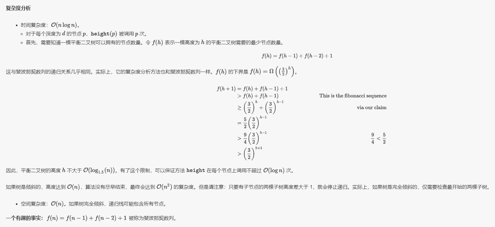

# 平衡二叉树

## 一、二叉搜索树

### 1、定义

* 每个节点中的值必须大于（或等于）存储在其左侧子树中的任何值。
* 每个节点中的值必须小于（或等于）存储在其右子树中的任何值。

### 2、验证二叉搜索树

#### [validate-binary-search-tree](https://leetcode-cn.com/problems/validate-binary-search-tree/)

给定一个二叉树，判断其是否是一个有效的二叉搜索树。

> 思路 1：中序遍历，检查结果列表是否已经有序
>
> 思路 2：分治法，判断左 MAX &lt; 根 &lt; 右 MIN

```text

```

#### [balanced-binary-tree](https://leetcode-cn.com/problems/balanced-binary-tree/)

给定一个二叉树，判断它是否是高度平衡的二叉树。

> 一棵高度平衡二叉树定义为：一个二叉树_每个节点_ 的左右两个子树的高度差的绝对值不超过1。

$$
\text{根据定义，一棵二叉树}\ T \text{存在节点} p\in T \text{，满足}\ ∣height(p.left)−height(p.right)∣>1 \text{时，}\\ \text{它是不平衡的。下图中每个节点的高度都被标记出来，高亮区域是一棵不平衡子树。}
$$


> 方法一：**自顶向下的递归**
>
> 定义方法 height，用于计算任意一个节点 p∈T 的高度：

$$
height(p)=\begin{cases} -1, & p\ \text{is an empty subtree i.e.} null \\ 1+max(height(p.left),height(p.right)), & \text{otherwise} \end{cases}
$$

> 接下来就是比较每个节点左右子树的高度。在一棵以 r 为根节点的树 T 中，只有每个节点左右子树高度差不大于 1 时，该树才是平衡的。因此可以比较每个节点左右两棵子树的高度差，然后向上递归。

```cpp
if (root == NULL)
    return true;
if (abs(height(root.left) - height(root.right)) > 1)
    return false;
else
    return isBalanced(root.left) && isBalanced(root.right);
```



> 方法二：**自底向上的递归**
>
> 方法一计算 height 存在大量冗余。每次调用 height 时，要同时计算其子树高度。但是自底向上计算，每个子树的高度只会计算一次。可以递归先计算当前节点的子节点高度，然后再通过子节点高度判断当前节点是否平衡，从而消除冗余。

```cpp
bool isBalancedTree(TreeNode *root, int &subHeight){
    if(!root){
        subHeight = 0;
        return true;
    }
    int x,y;
    bool bLeft = isBalancedTree(root->left, x);
    bool bRight = isBalancedTree(root->right, y);
    bool bIt = std::abs(x - y) > 1 ? false : true;
    subHeight = x > y ? x + 1 : y + 1;
    return bLeft && bRight && bIt;
}
bool isBalanced(TreeNode* root) {
    int height = 0;
    return isBalancedTree(root, height);
}
```


### 3、应用

#### [insert-into-a-binary-search-tree](https://leetcode-cn.com/problems/insert-into-a-binary-search-tree/)

给定二叉搜索树（BST）的根节点和要插入树中的值，将值插入二叉搜索树。 返回插入后二叉搜索树的根节点。 保证原始二叉搜索树中不存在新值。

```text

```

#### [delete-node-in-a-bst](https://leetcode-cn.com/problems/delete-node-in-a-bst/)

给定一个二叉搜索树的根节点 root 和一个值 key，删除二叉搜索树中的 key 对应的节点，并保证二叉搜索树的性质不变。返回二叉搜索树（有可能被更新）的根节点的引用。

```text

```

## 二、平衡二叉（搜索）树

