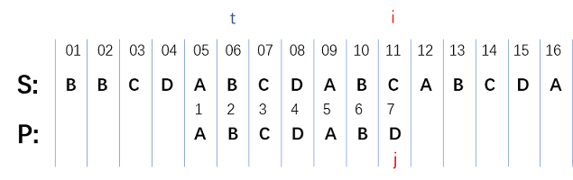

# 字符串

## ✏ 1、[模式匹配](https://leetcode-cn.com/problems/implement-strstr/)

字符串 $$S=[s_1,s_2,\ldots,s_n]$$ ，模式串 $$P=[p_1,p_2,\ldots,p_m]$$ ， $$i$$ 和 $$j$$ 为两个游标，从`1`开始。

**解决字符串的算法非常多：**

朴素算法（`Naive Algorithm`）、`Rabin-Karp` 算法、有限自动机算法（`Finite Automation`）、 `Knuth-Morris-Pratt` 算法（即 `KMP Algorithm`）、`Boyer-Moore` 算法、`Simon` 算法、`Colussi` 算法、`Galil-Giancarlo` 算法、`Apostolico-Crochemore` 算法、`Horspool` 算法和 `Sunday` 算法等。

### 🖋 1.1、`BF`算法

普通模式匹配算法，其实现过程没有任何技巧，就是简单粗暴地拿一个串同另一个串中的字符一一比对，得到最终结果。

```c
int strStr(string haystack, string needle) {
    int i = 0, j = 0;
    while(i < haystack.size() && j < needle.size()){
        if(haystack[i] == needle[j]){
            i++; j++;
        }else{
            i = i - j + 1; j = 0;
        }
    }
    if(j >= needle.size())
        return i - needle.size();
    else
        return -1;
}
```

时间复杂度分析，匹配成功时：

* 最好情况： $$s_1$$ 、 $$s_2$$ 、 $$\ldots$$ 、 $$s_{n-m}$$ 都与 $$p_1$$ 不匹配， $$[s_{n-m+1},\ldots,s_n]$$ 与 $$[p_1,p_2,\ldots,p_m]$$ 匹配，此时 $$i$$ 移动 $$n$$ 次， $$j$$ 移动 $$m$$ 次，复杂度 $$O(n+m)$$ 。
* 最坏情况：$$s_1$$ 、 $$s_2$$ 、 $$\ldots$$ 、 $$s_{m-1}$$ 与$$p_1$$ 、 $$p_2$$ 、 $$\ldots$$ 、 $$p_{m-1}$$ 匹配，但是 $$s_m$$ 与 $$p_m$$ 不匹配，同样，$$s_2$$ 、 $$s_3$$ 、 $$\ldots$$ 、 $$s_{m}$$ 与$$p_1$$ 、 $$p_2$$ 、 $$\ldots$$ 、 $$p_{m-1}$$ 匹配，但是$$s_{m+1}$$ 与 $$p_m$$ 不匹配，依次进行，直到$$s_{n-m+1}$$ 、 $$s_{n-m+2}$$ 、 $$\ldots$$ 、 $$s_{n}$$ 与$$p_1$$ 、 $$p_2$$ 、 $$\ldots$$ 、 $$p_{m}$$ 匹配成功，此时 $$i$$ 移动 $$m(n-m)$$ 次， $$j$$ 移动 $$m(n-m)$$ 次，复杂度 $$O(n\times m)$$ 。

分析：



如图所示在 $$p_7$$ 处产生失配时，朴素的算法会将 $$i$$ 退到的位置， $$j$$ 回到 $$1$$ 重新匹配，但我们发现 $$s_6\text{-}s_8$$ 与 $$p_2\text{-}p_4$$ 已经匹配，而 $$p_1$$ 与$$p_2\text{-}p_4$$ 皆不同，则与$$s_6\text{-}s_8$$ 匹配必然失败，又$$p_1p_2$$ 知$$p_5p_6$$ 与相同，则可知$$p_1p_2$$与$$p_9p_{10}$$一定匹配，由此可知，$$i$$ 不需要回退，$$j$$只需从 $$3$$ 开始继续匹配。

### 🖋 1.2、`KMP`算法

#### 🏀 1.2.1、分析

1. 当模式串在 $$p_1$$ 时就产生失配，则将 $$i+1$$ ，再比较 $$s_i$$ 和 $$p_1$$ ，依次向后进行；
2. 当匹配到 $$p_i$$ 时产生失配，


此时，保持 $$i$$ 不变，找到一个最大的 $$k$$ ，使 $$s_{i - k + 1}\text{-}s_{i - 1}=p_{1}\text{-}p_{k - 1}$$，更新 $$j=k$$ ，然后让 $$s_i$$ 和 $$p_j$$ 进行匹配。假设新的 $$j$$ 用 $$next[j]$$ 表示，则表示当模式串在 $$p_j$$ 时失配后，在模式串中需要重新和主串匹配的位置，由于 $$s_{i - k + 1}\text{-}s_{i - 1}$$ 与 $$p_{j - k + 1}\text{-}p_{j - 1}$$ 匹配，则 $$p_{1}\text{-}p_{k - 1}=p_{j - k + 1}\text{-}p_{j - 1}$$ ，即 $$k$$ 为 $$p_{1}\text{-}p_{k - 1}$$ 中相同的前缀和后缀的最大值加 $$1$$ 。

#### 🏀 1.2.2、求`next`数组

`next`数组的定义如下（由于从 $$1$$ 开始，为了对应，从 $$next[1]$$ 开始）：

$$
\begin{equation}
next[j]= \begin{cases}
	0, & j=1 \\
	max\{k | 1<k<j \text{且} p_1,\ldots,p_{k-1} = p_{j-k+1},\ldots,p_{j-1}\}, & \\
        1, & \text{其他情况}
\end{cases}
\end{equation}
$$

从`next`的定义出发，给出下面的求解程序：

```text

```

$$next[1]=0$$ 是为了与其他情况区分，虽然二者 $$j$$ 都会回退到 $$1$$ ，但 $$j=1$$ 时， $$i$$ 要 $$+1$$ 。

#### 🏀 1.2.3、根据`next`数组，可得`KMP`算法

```text

```

#### 🏀 1.2.4、通用`next`数组求法


### 🖋 1.3、题型

#### \*\*\*\*[**Implement strStr\(\)**](https://leetcode-cn.com/problems/implement-strstr/)\*\*\*\*

实现 `strStr()` 函数。给定一个 `haystack` 字符串和一个 `needle` 字符串，在 `haystack` 字符串中找出 `needle` 字符串出现的第一个位置 \(从0开始\)。如果不存在，则返回 `-1`。 对于本题而言，当 `needle` 是空字符串时我们应当返回 0 。这与C语言的 `strstr()` 以及 Java的 `indexOf()` 定义相符。

## ✏ 2、回文字符串

### 🖋 2.1、最长回文子串

#### [**Longest Palindromic Substring**](https://leetcode-cn.com/problems/longest-palindromic-substring/)\*\*\*\*

 给定一个字符串 `s`，找到 `s` 中最长的回文子串。你可以假设 `s` 的最大长度为 1000。

> 方法一、中心扩展，分为奇回文和偶回文，时间复杂度为 $$O(n^2)$$ 。
>
> 方法二、`Manacher`算法，见左神书：《程序员代码面试指南》。



```cpp
string longestPalindrome(string s) {
    string result = s.substr(0,1);
    int len = s.length();
    for(int i = 1;i < len;i++){
        if(s[i] == s[i - 1]){
            int m = i + 1;
            int n = i - 2;
            while(m < len && n >= 0 && s[m] == s[n]){
                m++; n--;
            }
            m--; n++;
            if(m - n + 1 > result.length())
                result = s.substr(n, m - n + 1);
        }
        if(i >= 2 && s[i] == s[i - 2]){
            int m = i + 1;
            int n = i - 3;
            while(m < len && n >= 0 && s[m] == s[n]){
                m++; n--;
            }
            m--; n++;
            if(m - n + 1 > result.length())
                result = s.substr(n, m - n + 1);
        }
    }

    return result;
}
```



```cpp
string longestPalindrome(string s) {
    if(s.empty()){
        return "";
    }
    string str(s.size() * 2 + 1, '#');
    for(int i = 1, j = 0; i < str.size() && j < s.size(); i += 2, j++)
        str[i] = s[j];
    vector<int> pArr(str.size());
    int index = -1;
    int pR = -1;
    int ans = INT_MIN;
    int t = 0;
    for(int i = 0; i < str.size(); i++){
        pArr[i] = pR > i ? min(pArr[2 * index - i], pR - i) : 1;
        while(i + pArr[i] < str.size() && i - pArr[i] > -1){
            if(str[i + pArr[i]] == str[i - pArr[i]]){
                pArr[i]++;
            }else{
                break;
            }
        }
        if(i + pArr[i] > pR){
            pR = i + pArr[i];
            index = i;
        }
        if(ans < pArr[i]){
            ans = pArr[i];
            t = i;
        }
    }
    // return ans - 1; // 最长回文字串长度
    string result;
    for(int i = t - ans + 1; i < t + ans; i++){
        if(str[i] != '#'){
            result.push_back(str[i]);
        }
    }
    return result;
}
```



### 🖋 2.2、扩展

[**让字符串成为回文串的最少插入次数**](https://leetcode-cn.com/problems/minimum-insertion-steps-to-make-a-string-palindrome/)\*\*\*\*

\*\*\*\*

\*\*\*\*


## ✏ 3、循环节问题

#### [**Repeated Substring Pattern**](https://leetcode-cn.com/problems/repeated-substring-pattern/)\*\*\*\*

给定一个非空的字符串，判断它是否可以由它的一个子串重复多次构成。给定的字符串只含有小写英文字母，并且长度不超过10000。


## ✏ 4、其他题目

### \*\*\*\*[**Add Binary**](https://leetcode-cn.com/problems/add-binary/)\*\*\*\*

给你两个二进制字符串，返回它们的和（用二进制表示）。输入为 **非空** 字符串且只包含数字 `1` 和 `0`。

* `1 <= a.length, b.length <= 10^4`
* 字符串如果不是 `"0"` ，就都不含前导零。

```text

```

### \*\*\*\*[**替换空格**](https://leetcode-cn.com/problems/ti-huan-kong-ge-lcof/)\*\*\*\*

 请实现一个函数，把字符串 `s` 中的每个空格替换成`"%20"`。

> 1、最容易想到方法的是新建字符串（如果是静态数组，则长度为原来的三倍），然后依次复制原串的内容到新串，遇到空格用`"%20"`替换。
>
> 2、其次是按空格拆分字符串`split`，然后再组合。
>
> 3、还有一种原地替换的方法：先根据空格数量在字符串末尾扩容两个字符的空间，然后倒叙遍历将原来位置的字符放到后面, 最后返回`s`就可以了。

```cpp
// const std::string p = "%20";
std::string StringHandler::replaceSpace(std::string s, const std::string p){
    int count = 0;
    for(auto c : s){
        if(c == ' ')
            ++count;
    }
    int len = count * p.size() + s.size() - count;
    string result(len, ' ');
    int i = 0;
    for(auto c : s){
        if(c != ' '){
            result[i++] = c;
        }
        else{
            for(auto d : p){
                result[i++] = d;
            }
        }
    }
    return result;
}
```

### \*\*\*\*[**First Unique Character in a String**](https://leetcode-cn.com/problems/first-unique-character-in-a-string/)\*\*\*\*

给定一个字符串，找到它的第一个不重复的字符，并返回它的索引。如果不存在，则返回 `-1`。

### \*\*\*\*[**Reverse Words in a String**](https://leetcode-cn.com/problems/reverse-words-in-a-string/)\*\*\*\*

```cpp
string reverseWords(string s) {
    string result;
    int left = 0, right = s.size() - 1;
    while(right >= 0){
        while(right >= 0 && s[right] == ' ') right--;
        if(right >= 0){
            left = right;
            while(left >= 0 && s[left] != ' ') left--;
            left++;
            if(left >= 0){
                for(int i = left; i <=right; i++){
                    result.push_back(s[i]);
                }
                result.push_back(' ');
            }
            right = left - 1;
        }
    }
    if(!result.empty() && result.back() == ' ')
        result.pop_back();
    return result;
}
```

### \*\*\*\*[**字符串转换整数 \(atoi\)**](https://leetcode-cn.com/problems/string-to-integer-atoi/)\*\*\*\*

 实现一个 `atoi` 函数，使其能将字符串转换成整数。

```cpp
int myAtoi(string str) {
    int idx = 0;
    if(str.empty())
        return 0;
    long long result = 0;
    int len = str.size();
    bool flag = true;
    while(idx < len && str[idx] == ' ')
        idx++;
    if(idx < len && (str[idx] == '-' || str[idx] == '+')){
        if(str[idx] == '-')
            flag = false;
        idx++;
    }
    if(idx >= len || !(str[idx] <= '9' && str[idx] >= '0'))
        return 0;
    while(idx < len && str[idx] <= '9' && str[idx] >= '0'){
        int num = str[idx] - '0';
        result = result * 10 + num;
        if(result >= long(INT_MAX) && flag){
            return INT_MAX;
        }
        if(result >= long(INT_MAX) + 1 && !flag){
            return INT_MIN;
        }
        idx++;
    }
    return flag ? result : -1 * result;
}
```

### \*\*\*\*[**Edit Distance**](https://leetcode-cn.com/problems/edit-distance/)\*\*\*\*

给你两个单词 `word1` 和 `word2`，请你计算出将 `word1` 转换成 `word2` 所使用的最少操作数 。

你可以对一个单词进行如下三种操作：

* 插入一个字符 
* 删除一个字符 
* 替换一个字符

```cpp
int minDistance(string word1, string word2) {
    int m = word1.size();
    int n = word2.size();
    if(m * n == 0) return n + m;
    vector<vector<int> > dp(m + 1, vector<int>(n + 1));
    for(int i = 0; i <= m; i++){
        dp[i][0] = i;
    }
    for(int i = 0; i <= n; ++i){
        dp[0][i] = i;
    }
    for(int i = 1; i <= m; ++i){
        for(int j = 1; j <= n; ++j){
            int a = dp[i - 1][j] + 1;
            int b = dp[i][j - 1] + 1;
            int c = dp[i - 1][j - 1];
            if(word1[i - 1] != word2[j - 1]) c++;
            dp[i][j] = min(a, min(b, c));
        }
    }
    return dp[m][n];
}
```

