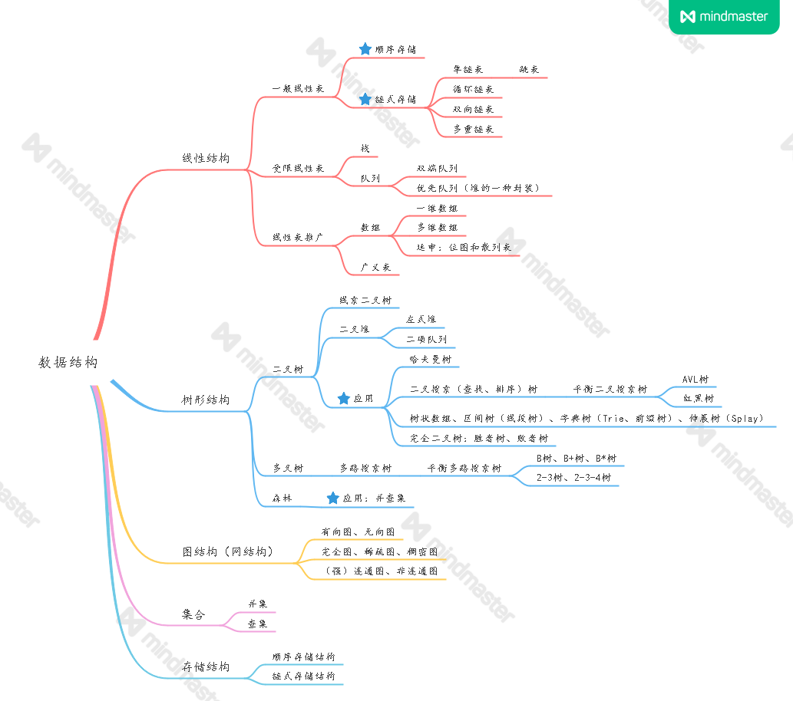

# Introduction

此项目是自己在准备找工作的时候，借助`leetcode`上的题目，对数据结构和算法的基础内容复习总结的。

[在线文档](https://mqjyl2012.gitbook.io/algorithm/)基于`Gitbook`所写，代码实现使用C++语言。并且整个文档可以在[Github](https://github.com/JLCreater2015/algorithm-pattern)上下载，文档中代码都是在`Leetcode`上经过测试并且顺利`Accepted`。`Github`上还上传了所有的代码，项目见[这里](https://github.com/JLCreater2015/algorithm-pattern-code)。

常用的数据结构总结如下（个人总结，如有不对之处请指教）：

**数据结构是工具，算法是通过合适的工具解决特定问题的方法**。也就是说，学习算法之前，最起码得了解那些常用的数据结构，了解它们的特性和缺陷。

注：第一部分C++基础部分的代码都在`VC16.0(VS2019)`或`GCC(Clion2020)`上测试过。有代码示例的地方，如果没有说明具体的平台，说明在两个平台上的支持是一样的，不一样的地方都会有说明。

**推荐的刷题顺序：二叉树—>线性表—>排序算法—>死磕二叉树—>动态规划—>滑动窗口—>回溯法—>其他类型（顺序随意）。一定要先刷二叉树，先刷二叉树，先刷二叉树，重要的事情说三遍。。。**

（说一下本人的复习情况，供参考，本人从7月1日开始刷题，这套笔记也是从那时候开始创建，知道10月25号百度面试结束，其中十一开始没有再刷题，七到十月份三个月的时间里是边面试边刷题边复习基础知识的状态，自认为基础不错，所以建议基础不太好的人能够在七月份之前将这上面总结的估计150-200道题的至少60%能做一遍，基本就可以开始面试了，如果想参加提前批，那就提前一个月。）

## 文档目录

### C++基础 :soccer:&#x20;

* [C++基础语法](c-cpp/c++-syntax/)
* [c语言](c-cpp/c/)
* [C++高级特性](c-cpp/advanced-c++/)
* [C++并发编程](c-cpp/cpp-concurrent-programming/#c-bing-fa-bian-cheng)
* [STL基础](c-cpp/stl-basics/)
* [C++标准库](c-cpp/cpp-standard-library/)
* [STL深入源码](c-cpp/stl-source-analysis/)
* [第三方库](c-cpp/third-party-libraries/)

### 数据结构 :basketball:&#x20;

* [线性表](data-structure/linear-list.md)
* [字符串](data-structure/string.md)
* [栈和队列](data-structure/stack-and-queue.md)
* [二叉树](data-structure/binary-tree.md)
* [平衡二叉树](data-structure/balanced-binary-tree.md)
* [平衡多路搜索树](data-structure/balanced-multipath-search-tree.md)
* [图](data-structure/graph.md)
* [二进制](data-structure/binary-system.md)
* [散列表](data-structure/hash-table.md)

### 算法基础 :volleyball:&#x20;

* [排序算法](algorithm/sort-algorithm.md)
* [查找算法](algorithm/search-algorithm.md)
* [数学问题](algorithm/mathematical-problems.md)
* [并查集](algorithm/union-find.md)
* [递归算法](algorithm/recursive-algorithm.md)
* [主定理](algorithm/master-theorem.md)

### 算法设计思想 :softball:&#x20;

* [滑动窗口思想](algorithm-thinking/sliding-window.md)
* [BFS/DFS](algorithm-thinking/bfs-dfs.md)
* [回溯法](algorithm-thinking/backtracking-algorithm.md)
* [贪心算法](algorithm-thinking/greedy-algorithm.md)
* [分治法](algorithm-thinking/divide-and-conquer-algorithm.md)
* [动态规划](algorithm-thinking/dynamic-programming-algorithm.md)
* [分支限界算法](algorithm-thinking/branch-and-bound.md)

### LeetCode系列 :football:&#x20;

* [死磕二叉树](leetcode/stick-to-binary-tree.md)
* [股票买卖问题](leetcode/stockjobbing.md)

### 经典算法问题 :tennis:&#x20;

* [表达式求值](classical-problem/expression-evaluation.md)
* [背包问题](classical-problem/backpack-questions.md)

## 面试资源

### 书籍 :melon:&#x20;

* 《数据结构与算法分析——C语言描述》
* 《数据结构》——邓俊辉

### 刷题网站 :tangerine:&#x20;

1. `Leetcode`：[https://leetcode-cn.com/problemset/all/](https://leetcode-cn.com/problemset/all/)
2. 牛客网：[https://www.nowcoder.com/activity/oj](https://www.nowcoder.com/activity/oj)
3. 洛谷：[https://www.luogu.com.cn/](https://www.luogu.com.cn/)
4. `Codewars`：[https://www.codewars.com/](https://www.codewars.com/)
5. `Hihocoder`：[http://hihocoder.com/problemset](http://hihocoder.com/problemset)
6. `Lintcode`：[https://www.lintcode.com/](https://www.lintcode.com/)
7. `Geeksforgeeks`：[https://www.geeksforgeeks.org/](https://www.geeksforgeeks.org/)
8. `Acwing`：[https://www.acwing.com/](https://www.acwing.com/)
9. `HIT Online Judge`：[http://acm.hit.edu.cn/](http://acm.hit.edu.cn/)

### 博客 :pineapple:&#x20;

* 查找算法：[https://mp.weixin.qq.com/s/yRLqpF5eT7jfp89VRWCFEw](https://mp.weixin.qq.com/s/yRLqpF5eT7jfp89VRWCFEw)
* `labuladong`：[https://labuladong.gitbook.io/algo/](https://labuladong.gitbook.io/algo/)
* `algorithm-pattern`：[https://greyireland.gitbook.io/algorithm-pattern/](https://greyireland.gitbook.io/algorithm-pattern/)

### 项目 :grapes:&#x20;

* 算法可视化：[https://github.com/algorithm-visualizer/algorithm-visualizer](https://github.com/algorithm-visualizer/algorithm-visualizer)
* `LeetCode`题解：[https://github.com/soulmachine/leetcode](https://github.com/soulmachine/leetcode)
* Linux命令搜索：[https://wangchujiang.com/linux-command/](https://wangchujiang.com/linux-command/)

## 相关链接

本人的其他笔记，博客等请移步下面的链接。。。

* 后台开发：[https://mqjyl2012.gitbook.io/backend-development/](https://mqjyl2012.gitbook.io/backend-development/)
