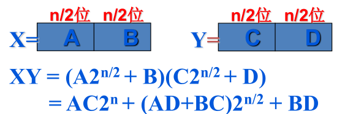
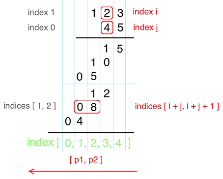
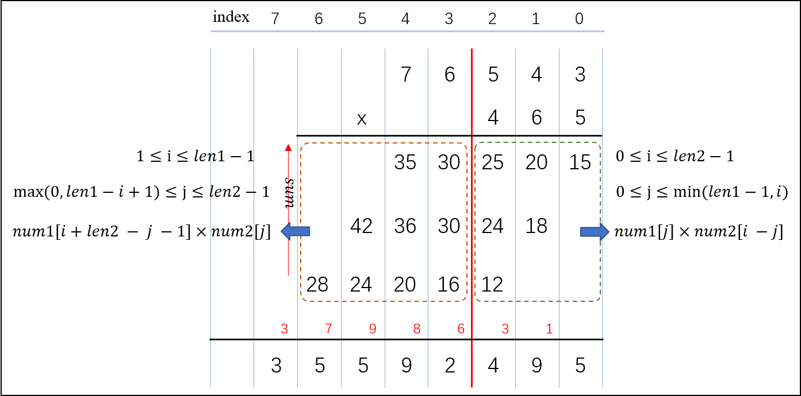

# 分治法

> 分治法即“分而治之”，就是把一个复杂的问题分成两个或更多的相同或相似的子问题，再把子问题分成更小的子问题……直到最后子问题可以简单的直接求解，原问题的解即子问题的解的合并。

## :pencil2: **可使用分治法求解的一些经典问题**

* 二分搜索
* 大整数乘法
* Strassen矩阵乘法
* 棋牌覆盖
* [归并排序](../algorithm/sort-algorithm.md#gui-bing-pai-xu-er-lu-gui-bing)和[快速排序](../algorithm/sort-algorithm.md#kuai-su-pai-xu)
* 线性时间选择
* 最接近点对问题
* 循环赛日程表
* 汉诺塔

## :pencil2: 算法实现

### :paintbrush: 1、[二叉树DFS深度搜索——自下而上](https://leetcode-cn.com/problems/binary-tree-preorder-traversal/)

```cpp
vector<int> preorderTraversal(TreeNode* root) {
    vector<int> result;
    // 返回条件(NULL)
    if(!root)
        return result;
    // 分治(Divide)
    vector<int> result_left, result_right;
    if(root->left){
        result_left = preorderTraversal(root->left);
    } 
    if(root->right){
        result_right = preorderTraversal(root->right);
    } 
    // 合并结果(Conquer)
    result.push_back(root->val);
    result.insert(result.end(), result_left.begin(), result_left.end());
    result.insert(result.end(), result_right.begin(), result_right.end());
    return result;
}  
```

### :paintbrush: 2、[大整数相乘](https://leetcode-cn.com/problems/multiply-strings/) 【[牛客网链接](https://www.nowcoder.com/questionTerminal/0f0badf5f2204a6bb968b0955a82779e)】

两个 $$n$$ 位的大整数相乘，按照基线乘法（也就是笔算乘法或竖式计算法），算法的时间复杂度是 $$O(n^2)$$ ，基线乘法在 $$O(n^2)$$ 的复杂度上进行计算和向上传递进位，每计算一次单精度乘法都要计算和传递进位，这样的话就使得嵌套循环的顺序性很强，难以并行展开和实现。有一种改进的 Comba 乘法，和普通的笔算乘法很类似，只是每一次单精度乘法只是单纯计算乘法，不计算进位，进位留到每一列累加后进行。所以原来需要 $$n^2$$ 次进位，现在最多只需要 $$2n$$ 次即可。

然而这个问题可以用分治法来解决，时间复杂度可降至 $$O(n^{1.59})$$ ，即**Karatsuba算法**。



算法：首先将 X 和 Y 分成A、B、C、D，此时将 X 和 Y 的乘积转化为图中的式子，把问题转化为求解式子的值。对于这个式子，我们一共要进行4 次乘法（AC、AD、BC、BD），所以 $$a = 4$$ ，建立递归方程：

$$
T(n) = 4 \times T(n / 2) + \theta(n)
$$

通过master定理可以求得该算法的时间复杂度为： $$T(n) = \theta(n ^ 2)$$ 。然后用加法来换取乘法：

$$
\begin{aligned}
XY & = (A\times 2^{\frac{n}{2}} + B)(C\times 2^{\frac{n}{2}} + D) \\
& = AC\times 2^n + ((A+B)(C+D)-AC-BD)\times 2^{\frac{n}{2}} + BD
\end{aligned}
$$

对于这个公式，一共进行了三次乘法（AC、BD、(A+B)(C+D)），因此， $$a = 3$$ ，建立递归方程：

$$
T(n) = 3 \times T(n / 2) + \theta(n)
$$

通过master定理求得时间复杂度为： $$T(n) = O(n^{log_2 3 }) = O(n^{1.59})$$ 。

另外常见的大数相乘算法还有 [**快速傅里叶变换算法**](https://en.wikipedia.org/wiki/Fast_Fourier_transform)**（** **fast Fourier transform** (**FFT**)**）。**

**这道题除了按普通的竖式求解（**&#x5373;遍历 `num2` 每一位与 `num1` 进行相乘，将每一步的结果进行累加）外，还可以**可以通过优化竖式来求解，两种优化方法：**

> 一、通过两数相乘时，乘数某位与被乘数某位相乘，与产生结果的位置的规律来完成。
>
> 具体规律如下：
>
> * 乘数 `num1` 位数为 $$M$$ ，被乘数 `num2` 位数为 $$N$$ ， `num1 x num2` 结果 `res` 最大总位数为 $$M+N$$ 。
> * `num1[i] x num2[j]` 的结果为 `tmp`(位数为两位，`"0x","xy"`的形式)，其第一位位于 `res[i+j]`，第二位位于 `res[i+j+1]`。



```cpp
string multiply(string num1, string num2) {
    if(num1[0] == '0' || num2[0] == '0'){
        return "0";
    }
    int len1 = num1.size();
    int len2 = num2.size();
    vector<int> res(len1 + len2);
    for (int i = len1 - 1; i >= 0; i--) {
        int n1 = num1[i] - '0';
        for (int j = len2 - 1; j >= 0; j--) {
            int n2 = num2[j] - '0';
            int sum = (res[i + j + 1] + n1 * n2);
            res[i + j + 1] = sum % 10;
            res[i + j] += sum / 10;
        }
    }
    string result;
    for (int i = 0; i < res.size(); i++) {
        if (i == 0 && res[i] == 0) 
            continue;
        result.push_back(char(res[i] + '0'));
    }
    return result;
}
```

> 二、模拟乘法，将所有数据不单独进位（可直接存入数组），最后统一进位。（实现）



```cpp
string multiply(string num1, string num2) {
    if(num1[0] == '0' || num2[0] == '0'){
        return "0";
    }
    string result;
    int carry = 0, sum = 0;
    int len1 = num1.size();
    int len2 = num2.size();
    for(int i = len2 - 1;i >= 0;i--){
        sum = 0;
        for(int j = len1 - 1;j >= 0 && i + (len1 - 1 - j) < len2;j--){
            sum += (num1[j] - '0') * (num2[i + (len1 - 1 - j)] - '0');
        }
        sum += carry;
        carry = sum / 10;
        result.insert(0, 1, char(sum % 10 + '0'));
    }
    for(int i = len1 - 2;i >= 0;i--){
        sum = 0;
        for(int j = 0;j < len2 && i - j >= 0;j++){
            sum += (num2[j] - '0') * (num1[i - j] - '0');
        }
        sum += carry;
        carry = sum / 10;
        result.insert(0, 1, char(sum % 10 + '0'));
    }
    while(carry > 0){
        result.insert(0, 1, char(carry % 10 + '0'));
        carry = carry / 10;
    }
    return result;
}
```

### :paintbrush: 3、[**最大子序和**](https://leetcode-cn.com/problems/maximum-subarray/)

给定一个整数数组 `nums` ，找到一个具有最大和的连续子数组（子数组最少包含一个元素），返回其最大和。

> #### 方法一：Kadane算法 <a href="#e6-96-b9-e6-b3-95-e4-b8-80-ef-bc-9akadane-e7-ae-97-e6-b3-95" id="e6-96-b9-e6-b3-95-e4-b8-80-ef-bc-9akadane-e7-ae-97-e6-b3-95"></a>

> 1. 遍历该数组， 在遍历过程中， 将遍历到的元素依次累加起来， 当累加结果小于或等于 0 时， 从下一个元素开始，重新开始累加。
> 2. 累加过程中， 要用一个变量 result 记录所获得过的最大值。
> 3. 一次遍历之后， 变量 result 中存储的即为最大子片段的和值。

```cpp
int maxSubArray(vector<int>& nums) {
    int result = nums[0]; // 要求子数组最少包含一个元素，
                          // 当数组中都为负数和0时，需要返回最大的一个值
    int current = 0;
    for(int i = 0;i < nums.size();i++){
        current += nums[i];
        if(current > result){
            result = current;
        }
        if(current < 0){
            current = 0;
        }
    }
    return result;
}
```

理解此算法的关键在于:

1. 最大子片段中不可能包含求和值为负的前缀。 例如 【-2， 1，4】 必然不能是最大子数列， 因为去掉值为负的前缀后【-2，1】， 可以得到一个更大的子数列 【4】、
2. 所以在遍历过程中，每当累加结果成为一个非正值时， 就应当将下一个元素作为潜在最大子数列的起始元素， 重新开始累加。
3. 由于在累加过程中， 出现过的最大值都会被记录， 且每一个可能成为 最大子数列起始元素 的位置， 都会导致新一轮的累加， 这样就保证了答案搜索过程的完备性和正确性。

> **方法二：动态规划**

> 在每一步，维护两个变量，一个是全局最优，就是到当前元素为止最优的解是，一个是局部最优，就是必须包含当前元素的最优的解。假设我们已知第 **`i`**&#x6B65;的`global[i]`（全局最优）和`local[i]`（局部最优），那么第`i+1`步的表达式是：
>
> 1. `local[i+1]=Math.max(A[i], local[i]+A[i])`，就是局部最优是一定要包含当前元素，所以不然就是`上一步的局部最优local[i]+当前元素A[i]`（因为`local[i]`一定包含第`i`个元素，所以不违反条件），但是如果`local[i]`是负的，那么他就是不需要的，所以直接用`A[i]`；
> 2. `global[i+1]=Math(local[i+1],global[i])`，有了当前的局部最优，那么全局最优就是当前的局部最优或者还是原来的全局最优。

```cpp
int maxSubArray(vector<int>& nums) {
    int local = nums[0];
    int global = nums[0];
    for(int i = 1;i < nums.size();i++){
        local = max(nums[i], local + nums[i]);
        global = max(local, global);
    }
    return global;
}
```

> 方法三：分治法
>
> 将数组均分为两个部分，那么最大子数组会存在于：
>
> * 左侧数组的最大子数组
> * 右侧数组的最大子数组
> * 左侧数组的以右侧边界为边界的最大子数组+右侧数组的以左侧边界为边界的最大子数组
>
> 假设数组下标有效范围是`l`到`r`，将数组分为左半部分下标为`（l，mid-1）`和右半部分下标为`(mid+1，r)`以及中间元素下标为`mid`，接下来递归求出左半部分的最大子序和：`left=helper(nums,l,mid-1)`；右半部分最大子序和`right=helper(nums,mid+1,r)`；
>
> 接下来再将左半部分右边界，右半部分左边界以及中间元素`nums[mid]`整合，用了两个循环，先整合左半部分右边界和中间值，再将整合结果与右半部分左边界整合得到整合以后的最大子序和`max_num`，最后返回`max_num`，`left`，`right`的最大值即是要求的最大子序和。

```cpp
int maxSubArrayRecursion(std::vector<int>& nums, int start, int stop){
    if(stop < start){
        return INT_MIN;//注意此处不是返回0，比如｛-2，-1｝，
        //分治以后变为左中右n｛｝，-1，｛-2｝三部分。左半部分｛｝应返回INT_MIN，
        //因为还要和右半部分的返回值进行比较,最终正确结果返回-1。
        //若左半部分返回0，0>-2,且大于左中右的最大组合值（-1），最终结果返回0，出错
    }
    if(stop == start){
        return nums[start];
    }
    int mid = (stop - start + 1) / 2 + start;
    int leftSum = maxSubArrayRecursion(nums, start, mid - 1);
    int rightSum = maxSubArrayRecursion(nums, mid + 1, stop);
    int midSum = nums[mid];
    int tmp = nums[mid];
    for(int i = mid - 1; i >= start; i--){
        tmp += nums[i];
        midSum = std::max(tmp, midSum);
    }
    tmp = midSum;
    for(int i = mid + 1; i <= stop; i++){
        tmp += nums[i];
        midSum = std::max(tmp, midSum);
    }
    return std::max(std::max(leftSum, rightSum), midSum);
}
int maxSubArray(vector<int>& nums) {
    return maxSubArrayRecursion(nums, 0, nums.size() - 1);
}
```

### :paintbrush: **4、**[**寻找两个正序数组的中位数**](https://leetcode-cn.com/problems/median-of-two-sorted-arrays/)

给定两个大小为 m 和 n 的正序（从小到大）数组 nums1 和 nums2。找出这两个正序数组的中位数，并且要求算法的时间复杂度为 $$O(log(m + n))$$ 。假设 nums1 和 nums2 不会同时为空。

> 方法一：走一趟遍历，边界情况很多，复杂度满足要求，但是代码很乱。

```cpp
double findMedianSortedArrays(vector<int>& nums1, vector<int>& nums2) {
    int len1 = nums1.size();
    int len2 = nums2.size();
    // 有一个数组为空的情况
    if(len1 == 0){
        return len2 % 2 == 1 ? nums2[len2 / 2] : (nums2[len2 / 2] + nums2[len2 / 2 - 1]) / 2.0;
    }
    if(len2 == 0){
        return len1 % 2 == 1 ? nums1[len1 / 2] : (nums1[len1 / 2] + nums1[len1 / 2 - 1]) / 2.0;
    }
    int count = (len1 + len2) / 2 - 1;
    int i = 0, j = 0;
    // 不管奇数还是偶数，都先保留两个数，最后统一做判断
    int num1, num2;
    // 跳过前count个数
    while(i < len1 && j < len2 && count > 0){
        if(nums1[i] < nums2[j])
            i++;
        else
            j++;
        count--;
    }
    // 接下来的连续两个数就是需要的
    if(count == 0){
        if(i >= len1){ // 两个数都在同一个数组
            num1 = nums2[j];
            num2 = nums2[j + 1];
        }else if(j >= len2){
            num1 = nums1[i];
            num2 = nums1[i + 1];
        }else if(j + 1 >= len2 && i + 1 >= len1){ // 两个数组都只有一个数字
            num1 = nums1[i];
            num2 = nums2[j];
        }else if(j + 1 >= len2){ // 一个数组有一个数字，另一个多于一个数字，所以三个中取两个小的
            num1 = min(nums1[i], nums1[i + 1]);
            num2 = min(max(nums1[i], nums1[i + 1]), nums2[j]);
        }else if(i + 1 >= len1){
            num1 = min(nums2[j], nums2[j + 1]);
            num2 = min(max(nums2[j], nums2[j + 1]), nums1[i]);
        }else{ // 两个数组都多于一个数字，所以四个中取两个小的
            if(nums1[i] < nums2[j]){
                num1 = nums1[i];
                i++;
            }else{
                num1 = nums2[j];
                j++;
            }
            if(nums1[i] < nums2[j]){
                num2 = nums1[i];
                i++;
            }else{
                num2 = nums2[j];
                j++;
            }
        }
    }else{  // 还没跳过count个数，其中一个数组就走完了
        if(i < len1){
            num1 = nums1[i + count];
            num2 = nums1[i + count + 1];
        }else{
            num1 = nums2[j + count];
            num2 = nums2[j + count + 1];
        }
    }
    // 统一判断奇数和偶数的情况
    double result = 0;
    if((len1 + len2) % 2 == 0){
        result = (num1 + num2) / 2.0;
    }else{
        result = max(num1, num2);
    }
    return result;
}
```

