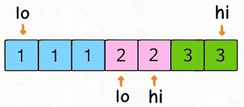
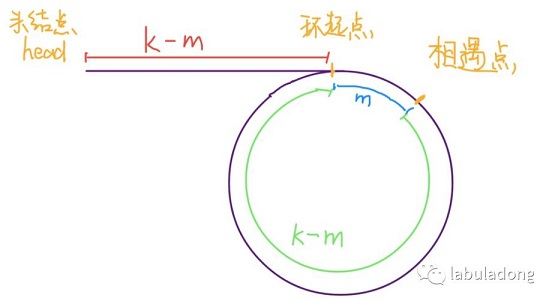
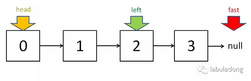

# 滑动窗口思想

双指针有三兄弟：快慢指针（链表）、左右指针（数组，串）、滑动窗口（链表，数组，串）。滑动窗口核心点是维护一个窗口集，根据窗口集来进行处理。

滑动窗口的应用场景有几个特点：

* 需要输出或比较的结果在原数据结构中是连续排列的；
* 每次窗口滑动时，只需观察窗口两端元素的变化，无论窗口多长，每次只操作两个头尾元素，当用到的窗口比较长时，可以显著减少操作次数；
* 窗口内元素的整体性比较强，窗口滑动可以只通过操作头尾两个位置的变化实现，但对比结果时往往要用到窗口中所有元素。

核心步骤：

* right 右移
* 收缩
* left 右移
* 求结果

## :pencil2: 1、左右指针

左右指针在数组中实际是指两个索引值，一般初始化为 `left = 0, right = nums.length - 1` 。

### :pen\_fountain:  1.1、[二分查找](../algorithm/search-algorithm.md#2-er-fen-cha-zhao)

### :pen\_fountain:  1.2、[两数之和](https://leetcode-cn.com/problems/two-sum-ii-input-array-is-sorted/)

```cpp
vector<int> twoSum(vector<int>& numbers, int target) {
    int lo = 0, hi = numbers.size() - 1;
    while(lo < hi){
        int tmp = numbers[lo] + numbers[hi];
        if(tmp == target){
            return std::vector<int>{lo + 1, hi + 1};
        }else if(tmp > target){
            hi--;
        }else{
            lo++;
        }
    }
    return std::vector<int>{};
}
```

把这个题目变得更泛化，更困难一点：

**`nums` 中可能有多对儿元素之和都等于 `target`，请你的算法返回所有和为`target` 的元素对儿，其中不能出现重复**。

函数签名如下：

```cpp
vector<vector<int>> twoSumTarget(vector<int>& nums, int target);
```

比如说输入为 `nums = [1,3,1,2,2,3], target = 4`，那么算法返回的结果就是：`[[1,3],[2,2]]`。对于修改后的问题，关键难点是现在可能有多个和为 `target` 的数对儿，还不能重复，比如上述例子中 `[1,3]` 和 `[3,1]` 就算重复，只能算一次。这种情况下使用上述的代码会造成重复的结果，比如说 `nums = [1,1,1,2,2,3,3], target = 4`，得到的结果中 `[1,3]` 肯定会重复。

出问题的地方在于 `sum == target` 条件的 if 分支，当给 `res` 加入一次结果后，`lo` 和 `hi` 不应该改变 1 的同时，还应该跳过所有重复的元素：



所以，可以对双指针的 while 循环做出如下修改：

```cpp
vector<vector<int>> twoSumTarget(vector<int>& nums, int target) {
    // nums 数组必须有序
    // sort(nums.begin(), nums.end()); // 如果无序，则排序
    int lo = 0, hi = nums.size() - 1;
    vector<vector<int>> res;
    while (lo < hi) {
        int sum = nums[lo] + nums[hi];
        int left = nums[lo], right = nums[hi];
        if (sum < target) {
            while (lo < hi && nums[lo] == left) lo++;
        } else if (sum > target) {
            while (lo < hi && nums[hi] == right) hi--;
        } else {
            res.push_back({left, right});
            while (lo < hi && nums[lo] == left) lo++;
            while (lo < hi && nums[hi] == right) hi--;
        }
    }
    return res;
}
```

这样，一个通用化的 `twoSum` 函数就写出来了。这个函数的时间复杂度非常容易看出来，双指针操作的部分虽然有那么多 while 循环，但是时间复杂度还是 `O(N)`，而排序的时间复杂度是 `O(NlogN)`，所以这个函数的时间复杂度是 `O(NlogN)`。

#### 1、[3Sum](https://leetcode-cn.com/problems/3sum/) 问题

泛化一下题目，不要光和为 0 的三元组了，计算和为 `target` 的三元组吧，同上面的 `twoSum` 一样，也不允许重复的结果：

```cpp
vector<vector<int>> threeSum(vector<int>& nums) {
    // 求和为 0 的三元组
    return threeSumTarget(nums, 0);
}

vector<vector<int>> threeSumTarget(vector<int>& nums, int target) {
    // 输入数组 nums，返回所有和为 target 的三元组
}
```

现在我们想找和为 `target` 的三个数字，那么对于第一个数字，可能是什么？`nums` 中的每一个元素 `nums[i]` 都有可能！确定了第一个数字之后，剩下的两个数字可以是什么呢？其实就是和为`target - nums[i]` 的两个数字，那不就是 `twoSum` 函数解决的问题么，需要把 `twoSum` 函数稍作修改即可复用：

```cpp
vector<vector<int>> twoSumTarget(vector<int>& nums, int start, int target) {
    // nums 数组必须有序
    // sort(nums.begin(), nums.end()); // 如果无序，则排序
    int lo = start, hi = nums.size() - 1;
    vector<vector<int>> res;
    while (lo < hi) {
        int sum = nums[lo] + nums[hi];
        int left = nums[lo], right = nums[hi];
        if (sum < target) {
            while (lo < hi && nums[lo] == left) lo++;
        } else if (sum > target) {
            while (lo < hi && nums[hi] == right) hi--;
        } else {
            res.push_back({left, right});
            while (lo < hi && nums[lo] == left) lo++;
            while (lo < hi && nums[hi] == right) hi--;
        }
    }
    return res;
}
// 三数之和
vector<vector<int>> threeSumTarget(vector<int>& nums, int target) {
    // 输入数组 nums，返回所有和为 target 的三元组
    sort(nums.begin(), nums.end());
    int len = nums.size();
    vector<vector<int>> res;
    for(int i = 0; i < len; ++i){
        vector<vector<int>> tuples = twoSumTarget(nums, i + 1, target - nums[i]);
        for(vector<int> &tuple : tuples){
            tuple.push_back(nums[i]);
            res.push_back(tuple);
        }
        while(i < len - 1 && nums[i] == nums[i + 1]) i++;
    }
    return res;
}
vector<vector<int>> threeSum(vector<int>& nums) {
    return threeSumTarget(nums, 0);
}
```

需要注意的是，类似 `twoSum`，`3Sum` 的结果也可能重复，比如输入是 `nums = [1,1,1,2,3], target = 6`，结果就会重复。

**关键点在于，不能让第一个数重复，至于后面的两个数，我们复用的 `twoSum` 函数会保证它们不重复**。所以代码中必须用一个 while 循环来保证 `3Sum` 中第一个元素不重复。

至此，`3Sum` 问题就解决了，时间复杂度不难算，排序的复杂度为`O(NlogN)`，`twoSumTarget` 函数中的双指针操作为 `O(N)`，`threeSumTarget`函数在 for 循环中调用 `twoSumTarget` 所以总的时间复杂度就是 `O(NlogN + N^2) = O(N^2)`。

#### 2、[4Sum](https://leetcode-cn.com/problems/4sum/)问题

&#x20;`4Sum` 完全就可以用相同的思路：穷举第一个数字，然后调用`3Sum` 函数计算剩下三个数，最后组合出和为 `target` 的四元组。

```cpp
vector<vector<int>> twoSumTarget(vector<int>& nums, int start, int target) {
    // nums 数组必须有序
    // sort(nums.begin(), nums.end()); // 如果无序，则排序
    int lo = start, hi = nums.size() - 1;
    vector<vector<int>> res;
    while (lo < hi) {
        int sum = nums[lo] + nums[hi];
        int left = nums[lo], right = nums[hi];
        if (sum < target) {
            while (lo < hi && nums[lo] == left) lo++;
        } else if (sum > target) {
            while (lo < hi && nums[hi] == right) hi--;
        } else {
            res.push_back({left, right});
            while (lo < hi && nums[lo] == left) lo++;
            while (lo < hi && nums[hi] == right) hi--;
        }
    }
    return res;
}
vector<vector<int>> threeSumTarget(vector<int>& nums, int start, int target) {
    // 输入数组 nums，返回所有和为 target 的三元组
    sort(nums.begin(), nums.end());
    int len = nums.size();
    vector<vector<int>> res;
    for(int i = start; i < len; ++i){
        vector<vector<int>> tuples = twoSumTarget(nums, i + 1, target - nums[i]);
        for(vector<int> &tuple : tuples){
            tuple.push_back(nums[i]);
            res.push_back(tuple);
        }
        while(i < len - 1 && nums[i] == nums[i + 1]) i++;
    }
    return res;
}

// 四数之和
std::vector<std::vector<int>> fourSum(std::vector<int>& nums, int target){
    // 数组需要排序
    sort(nums.begin(), nums.end());
    int n = nums.size();
    vector<vector<int>> res;
    // 穷举 fourSum 的第一个数
    for (int i = 0; i < n; i++) {
        // 对 target - nums[i] 计算 threeSum
        vector<vector<int>>
                triples = threeSumTarget(nums, i + 1, target - nums[i]);
        // 如果存在满足条件的三元组，再加上 nums[i] 就是结果四元组
        for (vector<int>& triple : triples) {
            triple.push_back(nums[i]);
            res.push_back(triple);
        }
        // fourSum 的第一个数不能重复
        while (i < n - 1 && nums[i] == nums[i + 1]) i++;
    }
    return res;
}
```

&#x20;这样，按照相同的套路，`4Sum` 问题就解决了，时间复杂度的分析和之前类似，for 循环中调用了 `threeSumTarget` 函数，所以总的时间复杂度就是 `O(N^3)`。

#### 3、nSum问题

&#x20;观察上面这些解法，统一出一个 `nSum` 函数：

```cpp
/* 注意：调用这个函数之前一定要先给 nums 排序 */
vector<vector<int>> nSumTarget(
    vector<int>& nums, int n, int start, int target) {

    int sz = nums.size();
    vector<vector<int>> res;
    // 至少是 2Sum，且数组大小不应该小于 n
    if (n < 2 || sz < n) return res;
    // 2Sum 是 base case
    if (n == 2) {
        // 双指针那一套操作
        int lo = start, hi = sz - 1;
        while (lo < hi) {
            int sum = nums[lo] + nums[hi];
            int left = nums[lo], right = nums[hi];
            if (sum < target) {
                while (lo < hi && nums[lo] == left) lo++;
            } else if (sum > target) {
                while (lo < hi && nums[hi] == right) hi--;
            } else {
                res.push_back({left, right});
                while (lo < hi && nums[lo] == left) lo++;
                while (lo < hi && nums[hi] == right) hi--;
            }
        }
    } else {
        // n > 2 时，递归计算 (n-1)Sum 的结果
        for (int i = start; i < sz; i++) {
            vector<vector<int>> 
                sub = nSumTarget(nums, n - 1, i + 1, target - nums[i]);
            for (vector<int>& arr : sub) {
                // (n-1)Sum 加上 nums[i] 就是 nSum
                arr.push_back(nums[i]);
                res.push_back(arr);
            }
            while (i < sz - 1 && nums[i] == nums[i + 1]) i++;
        }
    }
    return res;
}
```

看起来很长，实际上就是把之前的题目解法合并起来了，`n == 2` 时是`twoSum` 的双指针解法，`n > 2` 时就是穷举第一个数字，然后递归调用计算 `(n-1)Sum`，组装答案。

**需要注意的是，调用这个 `nSum` 函数之前一定要先给 `nums` 数组排序**，因为`nSum` 是一个递归函数，如果在 `nSum` 函数里调用排序函数，那么每次递归都会进行没有必要的排序，效率会非常低。

### :pen\_fountain:  1.3、反转数组和串

```cpp
void reverseString(vector<char>& s) {
    //reverse(s.begin(), s.end());
    int len = s.size();
    char tmp;
    for(int i = 0;i < len / 2;i ++){
        tmp = s[i];
        s[i] = s[len - 1 - i];
        s[len - 1 - i] = tmp;
    }
}
```

## :pencil2: 2、快慢指针

快慢指针一般都初始化指向链表的头结点 head，前进时快指针 fast 在前，慢指针 slow 在后，相隔相同的距离同时向前移动，利用双指针解决的问题有：

### :pen\_fountain: 2.1、[判定链表中是否有环](https://leetcode-cn.com/problems/linked-list-cycle/)

单链表的特点是每个节点只知道下一个节点，所以一个指针的话无法判断链表中是否含有环的。如果链表中不含环，那么这个指针最终会遇到空指针 null 表示链表到头了，因此可以判断该链表不含环。但是如果链表中含有环，那么这个指针就会陷入死循环，因为环形数组中没有 null 指针作为尾部节点。

经典解法就是用两个指针，一个每次前进两步，一个每次前进一步。如果不含有环，跑得快的那个指针最终会遇到 null，说明链表不含环；如果含有环，快指针最终会超慢指针一圈，和慢指针相遇，说明链表含有环。

```cpp
bool hasCycle(ListNode *head) {
    if(!head || !head->next)
        return false;
    ListNode *quickptr=head->next, *slowptr=head;
    while(quickptr && quickptr->next){
        if(quickptr == slowptr){
            return true;
        }
        quickptr = quickptr->next->next;
        slowptr = slowptr->next;
    }
    return false;
}
```

> 慢指针每次移动一步，快指针移动每次多少步，检测不到环？
>
> 设环外有m个节点，环内有n个节点，则设快指针每次前进 $$n+1$$ 步，如果在环入口处不相遇，则以后也不会相遇，则检测不到环。在环入口处相遇的条件： $$n = k\times m$$ (即n是m的倍数)，如果在环入口处相遇，则两者以后一直同步向前。在这里有一个前提，即 $$n > 2$$ ，否则一定会相遇。

### :pen\_fountain: 2.2、[已知链表中有环，找环的入口](https://leetcode-cn.com/problems/linked-list-cycle-ii/)

当快慢指针相遇时，让其中任一个指针重新指向头节点，然后让它俩以相同速度前进，再次相遇时所在的节点位置就是环开始的位置。这是为什么呢？第一次相遇时，假设慢指针 slow 走了 k 步，那么快指针 fast 一定走了 2k 步，也就是说比 slow 多走了 k 步（也就是环的长度）。

设相遇点距环的起点的距离为 m，那么环的起点距头结点 head 的距离为 k - m，也就是说如果从 head 前进 k - m 步就能到达环起点。如果从相遇点继续前进 k - m 步，也恰好到达环起点。



所以，只要我们把快慢指针中的任一个重新指向 head，然后两个指针同速前进，k - m 步后就会相遇，相遇之处就是环的起点了。

```cpp
ListNode *detectCycle(ListNode *head) {
    if(!head || !head->next)
        return NULL;
    ListNode *quickptr=head->next, *slowptr=head;
    while(quickptr && quickptr->next){
        if(quickptr == slowptr){
            quickptr = head;
            slowptr = slowptr->next;
            break;
        }
        quickptr = quickptr->next->next;
        slowptr = slowptr->next;
    }
    if(quickptr == head){
        while(quickptr != slowptr){
            quickptr = quickptr->next;
            slowptr = slowptr->next;
        }
        return quickptr;
    }
    return NULL;
}
```

### :pen\_fountain: 2.3、寻找链表的中点

让快指针一次前进两步，慢指针一次前进一步，当快指针到达链表尽头时，慢指针就处于链表的中间位置。

```cpp
ListNode *midNode(ListNode *head) {
    ListNode slow, fast;
    slow = fast = head;
    while (fast != null && fast.next != null) {
        fast = fast.next.next;
        slow = slow.next;
    }
    // slow 就在中间位置
    return slow;
}
```

当链表的长度是奇数时，slow 恰巧停在中点位置；如果长度是偶数，slow 最终的位置是中间偏右：



寻找链表中点的一个重要作用是对链表进行归并排序。回想数组的归并排序：求中点索引递归地把数组二分，最后合并两个有序数组。对于链表，合并两个有序链表是很简单的，难点就在于二分。

### :pen\_fountain: 2.4、寻找链表的倒数第 k 个元素

让快指针先走 k 步，然后快慢指针开始同速前进。这样当快指针走到链表末尾 null 时，慢指针所在的位置就是倒数第 k 个链表节点（为了简化，假设 k 不会超过链表长度）：

```cpp
ListNode *midNode(ListNode *head) {
    ListNode slow, fast;
    slow = fast = head;
    while (k-- > 0) 
        fast = fast.next;
    
    while (fast != null) {
        slow = slow.next;
        fast = fast.next;
    }
    return slow;
}
```

## :pencil2: 3、双指针题型

#### [**Container With Most Water**](https://leetcode-cn.com/problems/container-with-most-water/)

给 `n` 个非负整数 $$a_1$$ ，$$a_2$$，...，$$a_n$$，每个数代表坐标中的一个点  $$(i,a_i)$$ 。在坐标内画 `n` 条垂直线，垂直线 `i` 的两个端点分别为 $$(i,a_i)$$  和 $$(i,0)$$ 。找出其中的两条线，使得它们与 `x` 轴共同构成的容器可以容纳最多的水。

说明：不能倾斜容器，且 n 的值至少为 2。

> &#x20;**算法流程：** 设置双指针 start，stop 分别位于容器壁两端，根据规则移动指针，并且更新面积最大值 `result`，直到 `start == stop` 时返回 `result`。
>
> &#x20;**指针移动规则：**&#x8BBE;每一状态下水槽面积为 $$S(start,stop),(0<=start<stop<=n)$$ ，由于水槽的实际高度由两板中的短板决定，则可得面积公式 $$S(start,stop) = min(h[start], h[stop]) × (stop - start)$$。&#x20;
>
> 在每一个状态下，无论长板或短板收窄 1 格，都会导致水槽 底边宽度 −1：&#x20;
>
> * 若向内移动短板，水槽的短板 $$min(h[start], h[stop])$$ 可能变大，因此水槽面积 $$S(start,stop)$$ 可能增大。&#x20;
> * 若向内移动长板，水槽的短板 $$min(h[start], h[stop])$$ 不变或变小，下个水槽的面积一定小于当前水槽面积。
>
> 因此，向内收窄短板可以获取面积最大值。
>
> 换个角度理解： 若不指定移动规则，所有移动出现的 $$S(start,stop)$$ 的状态数为 $$C(n,2)$$ ，即暴力枚举出所有状态。 在状态 $$S(start,stop)$$ 下向内移动短板至 $$S(start + 1,stop)$$ （假设 $$height[start] < height[stop]$$ ），则相当于消去了 $$\{ S(start,stop - 1),  S(start,stop - 2), \ldots, S(start,start + 1) \}$$ 状态集合。而所有消去状态的面积一定 $$<=S(start,stop)$$ ：&#x20;
>
> * 短板高度：相比 $$S(start,stop)$$ 相同或更短（ $$<=height[start]$$ ）；&#x20;
> * 底边宽度：相比 $$S(start,stop)$$ 更短。&#x20;
>
> 因此所有消去的状态的面积都 $$< S(start,stop)$$ 。通俗的讲，我们每次向内移动短板，所有的消去状态都不会导致丢失面积最大值 。

```cpp
int maxArea(vector<int>& height) {
    int start = 0;
    int stop = height.size() - 1;
    int result = min(height[start], height[stop]) * (stop - start);
    while(start < stop){
        height[start] > height[stop] ? stop-- : start++;
        result = max(result, min(height[start], height[stop]) * (stop - start));
    }
    return result;
}
```

[**Valid Palindrome**](https://leetcode-cn.com/problems/valid-palindrome/)

```cpp
int isValid(char c){
    if((c >= 'a' && c <= 'z') || (c >= 'A' && c <= 'Z')){
        return 1;
    }
    if(c >= '0' && c <= '9'){
        return 2;
    }
    return 0;
}
bool isPalindrome(string s) {
    int start = 0, stop = s.size() - 1;
    while(start < stop){
        while(start < stop && isValid(s[start]) == 0)
            start++;
        while(start < stop && isValid(s[stop]) == 0)
            stop--;
        if(start < stop){
            if(s[start] == s[stop] 
               || (isValid(s[start]) == 1 
                   && isValid(s[stop]) == 1 
                   && abs(s[start] - s[stop]) == abs('a' - 'A'))) {
                start++, stop--;
            }else{
                return false;
            }
        }
    }
    return true;
}
```

> C++中提供了一系列的宏定义，可以使用：
>
> * `isalpha()`用来判断一个字符是否为字母，如果是字符则返回非零，否则返回零。
> * `isalnum()`用来判断一个字符是否为数字或者字母，也就是说判断一个字符是否属于a\~z||A\~Z||0\~9。
> * `islower()`用来判断一个字符是否为小写字母。
> * `isupper()`用来判断一个字符是否为大写字母。
> * `alpha()` 判断输入的字符是否为字母，即是否在 "A -- Z" 或者 "a -- z"之间，是字母则返回非0整数，不是字符则返回0。
> * `isdigit()` 判断输入的字符是否是数字。
> * `toupper(c)` 将小写字母c转为大写，返回大写 c 的ASCII码，由于char类型变量接收，内部自动完成转换。
> * `tolower(C)` 将大写字母C转为小写，返回小写 c 的ASCII码，由于char类型变量接收，内部自动完成转换。

## :pencil2: 4、滑动窗口

### :pen\_fountain: 4.1、模板 :grapes:&#x20;

```cpp
/* 滑动窗口算法框架 */
void slidingWindow(string s, string t) {
    unordered_map<char, int> need, window;
    for(char c : t) need[c]++;
    
    int left = 0, right = 0;
    int valid = 0; 
    while(right < s.size()) {
        // c 是将移入窗口的字符
        char c = s[right];
        // 右移窗口
        right++;
        // 进行窗口内数据的一系列更新
        ...

        /*** debug 输出的位置 ***/
        printf("window: [%d, %d)\n", left, right);
        /********************/
        
        // 判断左侧窗口是否要收缩
        while(window needs shrink) {
            // 更新结果
            ...
            // d 是将移出窗口的字符
            char d = s[left];
            // 左移窗口
            left++;
            // 进行窗口内数据的一系列更新
            ...
        }
    }
}
```

说明：

1. &#x20;使用 `left` 和 `right` 变量初始化窗口的两端，注意区间 `[left, right)` 是左闭右开的，所以初始情况下窗口没有包含任何元素，`right`也要从`0`开始。
2. 其中 `valid` 变量表示窗口中满足 `need` 条件的字符个数，如果 `valid` 和 `need.size` 的大小相同，则说明窗口已满足条件，已经完全覆盖了串 `T`。

套模板，只需要思考以下四个问题：

1. 当移动 `right` 扩大窗口，即加入字符时，应该更新哪些数据？
2. 什么条件下，窗口应该暂停扩大，开始移动 `left` 缩小窗口？
3. 当移动 `left` 缩小窗口，即移出字符时，应该更新哪些数据？
4. 我们要的结果应该在扩大窗口时还是缩小窗口时进行更新？

如果一个字符进入窗口，应该增加 `window` 计数器；如果一个字符将移出窗口的时候，应该减少 `window` 计数器； 当 `valid` 满足 `need` 时应该收缩窗口；应该在收缩窗口的时候更新最终结果。

### :pen\_fountain: 4.2、题目

#### [**Minimum Size Subarray Sum**](https://leetcode-cn.com/problems/minimum-size-subarray-sum/)

给定一个含有 n 个正整数的数组和一个正整数 s ，找出该数组中满足其和 `≥ s` 的长度最小的 连续 子数组，并返回其长度。如果不存在符合条件的子数组，返回 0。

&#x20;**进阶：**&#x5982;果你已经完成了 $$O(n)$$ 时间复杂度的解法, 请尝试 $$O(n log n)$$ 时间复杂度的解法。

> 一、滑动窗口：右端依次进入，当窗口内的和大于等于s的时候，左端开始移出直到和小于s，用此时的窗口长度+1去更新全局的最小窗口长度。

```cpp
int minSubArrayLen(int s, vector<int>& nums) {
    if(nums.empty())
        return 0;
    int start = 0, stop = 0;
    int sum = 0;
    int result = nums.size() + 1;
    int tmpLen = 0;
    while(stop < nums.size()){
        sum += nums[stop];
        tmpLen++;
        if(sum >= s){
            while(sum >= s){
                sum -= nums[start++];
                tmpLen--;
            }
            result = min(result, tmpLen + 1);
        }
        stop++;
    }
    return result == nums.size() + 1 ? 0 : result;
}
```

> 二、二分查找：额外创建一个数组 $$\text{sums}$$ 用于存储数组 $$\text{sums}$$ 的前缀和，其中 $$\text{sums}[i]$$ 表示从 $$\text{nums}[0]$$ 到 $$\text{nums}[i - 1]$$ 的元素和。得到前缀和之后，对于每个开始下标 $$i$$ ，可通过二分查找得到大于或等于 $$i$$ 的最小下标 `bound`，使得 $$\text{sums}[\textit{bound}]-\text{sums}[i-1] \ge s$$ ，并更新子数组的最小长度（此时子数组的长度是 $$\textit{bound}-(i-1)$$ )。
>
> &#x20;**因为这道题保证了数组中每个元素都为正，所以前缀和一定是递增的，这一点保证了二分的正确性。**

```cpp
int lower_bound(std::vector<int>& nums, int target){
    int left = 0, right = nums.size() - 1;
    int mid = -1;
    while(left < right){
        mid = (left + right) / 2;
        if(nums[mid] < target)
            left = mid + 1;
        else
            right = mid;
    }
    return nums[left] >= target ? left : -1;
}
int minSubArrayLen(int s, vector<int>& nums) {
    int len = nums.size();
    if(len == 0)
        return 0;
    int result = len + 1;
    std::vector<int> sums(len + 1, 0);
    for(int i = 1;i <= len;i++){
        sums[i] = sums[i - 1] + nums[i - 1];
    }
    for(int i = 1;i <= len;i++){
        int target = sums[i - 1] + s;
        // auto bound = std::lower_bound(sums.begin(), sums.end(), target);
        int bound = lower_bound(sums, target);
        //if(bound != sums.end()){
        //    result = std::min(result, static_cast<int>(bound - sums.begin()) - (i - 1));
        //}
        if(bound != -1){
            result = std::min(result, bound - (i - 1));
        }
    }
    return result == len + 1 ? 0 : result;
}
```

在很多语言中，都有现成的库和函数来为我们实现这里二分查找大于等于某个数的第一个位置的功能，比如 C++ 的 `lower_bound`，Java 中的 `Arrays.binarySearch`，C# 中的 `Array.BinarySearch`，Python 中的 `bisect.bisect_left`。

#### [minimum-window-substring](https://leetcode-cn.com/problems/minimum-window-substring/)

给你一个字符串 S、一个字符串 T，请在字符串 S 里面找出：包含 T 所有字符的最小子串。

**说明：**

* 如果 S 中不存这样的子串，则返回空字符串 `""`。
* 如果 S 中存在这样的子串，保证它是唯一的答案。
* 此题的测试用例中有 `s="a",t="aa",答案是""`。说明不能忽略重复。

```cpp
string minWindow(string s, string t) {
    if(s.empty() || t.empty())
        return "";
    std::unordered_map<char, int> need, window;
    for(char c : t)
        need[c]++;
    int left = 0, right = 0;
    int valid = 0;
    int len = s.size() + 1, start = 0;
    while(right < s.size()){
        char c = s[right];
        right++;
        if(need.count(c) > 0){
            window[c]++;
            if(need[c] == window[c])
                valid++;
        }
        while(valid == need.size()){
            if(len > right - left){
                len = right - left;
                start = left;
            }
            char d = s[left];
            left++;
            if(need.count(d) > 0){
                if(need[d] == window[d])
                    valid--;
                window[d]--;
            }
        }
    }
    return len == s.size() + 1 ? "" : s.substr(start, len);
}
```

> 复杂度分析：
>
> 时间复杂度：最坏情况下左右指针对 $$s$$ 的每个元素各遍历一遍，哈希表中对 $$s$$ 中的每个元素各插入、删除一次，对 $$t$$ 中的元素各插入一次，则渐进时间复杂度为 $$O( |s| + |t|)$$ 。

> 空间复杂度：用了两张哈希表作为辅助空间，每张哈希表最多不会存放超过`t`的字符集大小的键值对，我们设字符集大小为 $$C$$ ，则渐进空间复杂度为 $$O(C)$$ 。

#### [permutation-in-string](https://leetcode-cn.com/problems/permutation-in-string/)

给定两个字符串 **s1** 和 **s2**，写一个函数来判断 **s2** 是否包含 **s1** 的排列。换句话说，第一个字符串的排列之一是第二个字符串的子串。

**注意：**

1. 输入的字符串只包含小写字母
2. 两个字符串的长度都在 \[1, 10,000] 之间

```cpp
bool checkInclusion(string s1, string s2) {
    std::unordered_map<char, int> need, window;
    for(char c : s1)
        need[c]++;
    int left = 0, right = 0;
    int valid = 0;
    while(right < s2.size()){
        char c = s2[right];
        right++;
        if(need.count(c)){
            window[c]++;
            if(need[c] == window[c])
                valid++;
        }
        while(right - left >= s1.size()){
            if(valid == need.size())
                return true;
            char d = s2[left];
            left++;
            if(need.count(d)){
                if(need[d] == window[d])
                    valid--;
                window[d]--;
            }
        }
    }
    return false;
}
```

对于这道题的解法代码，基本上和最小覆盖子串一模一样，只需要改变两个地方：

1. 本题移动 left 缩小窗口的时机是窗口大小大于 `t.size()` 时，因为排列嘛，显然长度应该是一样的。
2. 当发现 `valid == need.size()` 时，就说明窗口中就是一个合法的排列，所以立即返回 true。

至于如何处理窗口的扩大和缩小，和最小覆盖子串完全相同。

#### [find-all-anagrams-in-a-string](https://leetcode-cn.com/problems/find-all-anagrams-in-a-string/)

给定一个字符串 s 和一个非空字符串 p，找到 s 中所有是 p 的字母异位词的子串，返回这些子串的起始索引。字符串只包含小写英文字母，并且字符串 s 和 p 的长度都不超过 20100。

说明：字母异位词指字母相同，但排列不同的字符串。 不考虑答案输出的顺序。

```cpp
vector<int> findAnagrams(string s, string p) {
    std::unordered_map<char, int> need, window;
    std::vector<int> result;
    for(char c : p)
        need[c]++;
    int left = 0, right = 0;
    int valid = 0;
    while(right < s.size()){
        char c = s[right];
        right++;
        if(need.count(c)){
            window[c]++;
            if(need[c] == window[c])
                valid++;
        }
        while(right - left >= p.size()){
            if(valid == need.size())
                result.push_back(left);
            char d = s[left];
            left++;
            if(need.count(d)){
                if(need[d] == window[d])
                    valid--;
                window[d]--;
            }
        }
    }
    return result;
}
```

#### [longest-substring-without-repeating-characters](https://leetcode-cn.com/problems/longest-substring-without-repeating-characters/)

&#x20;给定一个字符串，请你找出其中不含有重复字符的 **最长子串** 的长度。



```cpp
int lengthOfLongestSubstring(string s) {
    int result = 0;
    int len = s.size();
    if(len == 0 || len == 1)
        return len;
    unordered_map<char, int> window;
    int left = 0, right = 0;
    while(right < len){
        char c = s[right];
        right++;
        window[c]++;
        if(window[c] > 1){
            result = max(result, right - left - 1);
            while(s[left] != c){
                window[s[left]]--;
                left++;
            }
            window[s[left]]--;
            left++;
        }
    }
    return max(result, right - left);
}
```



```cpp
int lengthOfLongestSubstring(string s) {
    int result = 0;
    int len = s.size();
    if(len == 0 || len == 1)
        return  len;
    int start = 0, current = 1;
    while(current < len){
        for(int i = current - 1; i >= start; i--){
            if(s[i] == s[current]){
                start = i + 1;
                break;
            }
        }
        result = result < (current - start + 1) ? (current - start + 1) : result;
        current++;
    }

    return result;
}
```



#### [**Max Consecutive Ones III**](https://leetcode-cn.com/problems/max-consecutive-ones-iii/)

给定一个由若干 `0` 和 `1` 组成的数组 `A`，我们最多可以将 `K` 个值从 0 变成 1 （`0 <= K <= A.length`）。返回仅包含 1 的最长（连续）子数组的长度。

```cpp
int longestOnes(vector<int>& A, int K) {
    if(K == A.size())
        return K;
    int left = 0, right = 0;
    int result = 0, window = 0;
    while(right < A.size()){
        int i = A[right];
        right++;
        if(i == 1 || K > 0) {
            window++;
            if(i == 0)
                K--;
        }else{
            result = std::max(result, window);
            window++;
            K--;
            while(K < 0){
                int j = A[left];
                left++;
                window--;
                if(j == 0){
                    K++;
                }
            }
        }
    }
    return std::max(result, window);
}
```

#### [至多包含 K 个不同字符的最长子串](https://leetcode-cn.com/problems/longest-substring-with-at-most-k-distinct-characters/)

&#x20;给定一个字符串 **s** ，找出 **至多** 包含 k 个不同字符的最长子串 **T**。

```cpp
int lengthOfLongestSubstringKDistinct(std::string s, int k){
    if(s.size() == 0 || k <= 0)
        return 0;
    unordered_map<char, int > m;
    int l = 0, r = 0;   // 滑动窗口左右指针
    int maxLen = 1;     // 最大长度
    int count = 0;
    while(r < s.size()){
        if (m[s[r]] == 0)
            count ++;
        m[s[r]] += 1;
        r++;
        // 左指针移动减小
        while (count > k){
            if(m[s[l]] == 1)
                count--;
            m[s[l]] -= 1;
            l++;
        }
        maxLen = max(maxLen, r - l);
    }
    return maxLen;
}
```

#### [彩色宝石项链](https://www.nowcoder.com/questionTerminal/321bf2986bde4d799735dc9b493e0065)

有一条彩色宝石项链，是由很多种不同的宝石组成的，包括红宝石，蓝宝石，钻石，翡翠，珍珠等。有一天国王把项链赏赐给了一个学者，并跟他说，你可以带走这条项链，但是王后很喜欢红宝石，蓝宝石，紫水晶，翡翠和钻石这五种，我要你从项链中截取连续的一小段还给我，这一段中必须包含所有的这五种宝石，剩下的部分你可以带走。如果无法找到则一个也无法带走。请帮助学者找出如何切分项链才能够拿到最多的宝石。

**输入描述：**&#x6211;们用每种字符代表一种宝石，A表示红宝石，B表示蓝宝石，C代表紫水晶，D代表翡翠，E代表钻石，F代表玉石，G代表玻璃等等，我们用一个全部为大写字母的字符序列表示项链的宝石序列，注意项链是首尾相接的。
