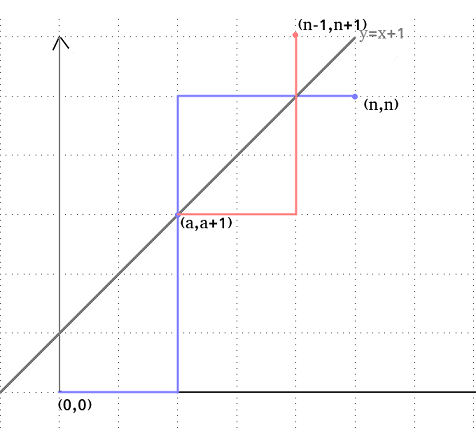
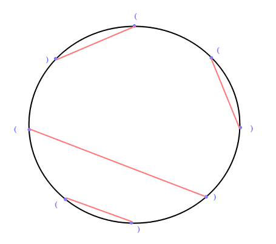
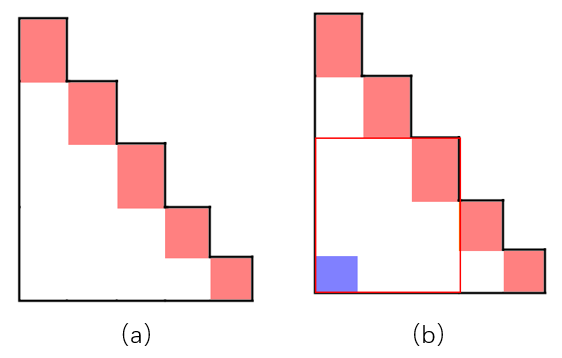

# Catalan数

卡特兰数是组合数据中一个常在各种计数问题中出现的数列，由比利时的数学家欧仁.查理.卡特兰（1814-1894）命名。Catalan数的定义：

令 $$f_0=1$$ ， $$f_1=1$$， Catalan数满足递归式：&#x20;

$$f_n=f_0\times f_{n−1}+f_1\times f_{n−2}+…+f_{n−1}f_0$$ ，其中 $$n\ge 2$$&#x20;

递推关系： $$f_n=\frac{4n−2}{n+1}f_{n−1}$$&#x20;

通项公式： $$f_n=\frac{1}{n+1}C^n_{2n}$$&#x20;

经化简后可得： $$f_n=C^n_{2n}−C^{n−1}_{2n}$$&#x20;

## :pen\_fountain: 实际问题

在一个 $$w\times h$$ 的网格上，你最开始在 $$(0,0)$$ 上，你每个单位时间可以向上走一格，或者向右走一格，在任意一个时刻，你往右走的次数都不能少于往上走的次数，问走到 $$(n,n),0\le n$$ 有多少种不同的合法路径。**合法路径个数为** $$C^n_{2n}−C^{n−1}_{2n}$$ 。

#### 思路：

路径总数为在 $$2n$$ 次移动中选 n 次向上移动，即 $$C^n_{2n}$$ ，画一下图，我们把 $$y=x+1$$ 这条线画出来，发现所有的合法路径都是不能碰到这条线的，碰到即说明是一条不合法路径。先随便画一条碰到这条线的不合法路径，所有的不合法路径都会与这条线有至少一个交点，我们把第一个交点设为 $$(a,a+1)$$ ，如图：

.png>)

我们把 $$(a,a+1)$$ 之后的路径全部按照 $$y=x+1$$ 这条线对称过去，这样，最后的终点就会变成 $$(n−1,n+1)$$ 。

由于所有的不合法路径一定会与 $$y=x+1$$ 有这么一个交点，我们可以得出，所有不合法路径对称后都唯一对应着一条到 $$(n−1,n+1)$$ 的路径，且所有到 $$(n−1,n+1)$$ 的一条路径都唯一对应着一条不合法路径（只需将其对称回去即可），所以不合法路径总数是 $$C^{n−1}_{2n}$$ ，那么合法的路径总数为 $$C^n_{2n}−C^{n−1}_{2n}$$ 。 这是一个非常好用且重要的一个方法，其它的问题也可以用该方法解决，即**找到不合法路径唯一对应的到另一个点的路径。**

**拓展：**

如果是n个&#x31;**，**&#x6D;个0呢？不过是最后的终点变为了 $$(n,m)$$ 罢了。

如果是1的个数不能够比0少k呢？只需将 $$y=x+1$$ 这条线上下移动即可。

## :pencil2: 相关题型

### :gem: **1、**&#x30;1序列

你现在有n个0和n个1，问有多少个长度为 $$2n$$ 的序列，使得序列的任意一个前缀中1的个数都大于等于0的个数？例如n=2时，有`1100,1010`两种合法序列，而`1001,0101,0110,00111001,0101,0110,0011`都是不合法的序列，**合法的序列个数为** $$C^n_{2n}−C^{n−1}_{2n}$$ 。

我们把出现一个1看做向右走一格，出现一个0看做向上走一格，那么这个问题就和上面的例题一模一样。

### :gem: 2、括号匹配

有n个左括号，n个右括号，问有多少个长度为 $$2n$$ 的括号序列使得所有的括号都是合法的？（同：给定具有n个数字的中缀表达式，通过完全加括号的方式确定计算顺序，求所有方案数）

**合法的序列个数为** $$C^n_{2n}−C^{n−1}_{2n}$$ 。

要使所有的括号合法，实际上就是在每一个前缀中左括号的数量都不少于右括号的数量，将左括号看做1，右括号看做0，这题又和上面那题一模一样了。

### :gem: 3、进出栈问题

有一个栈，我们有 $$2n$$ 次操作，n次进栈，n次出栈，问有多少中合法的进出栈序列？（即给定一个入栈序列，求所有合法的出栈序列的个数）

**合法的序列个数为** $$C^n_{2n}−C^{n−1}_{2n}$$ 。

要使序列合法，在任何一个前缀中进栈次数都不能少于出栈次数。

### :gem: 4、312排列

一个长度为n的排列a，只要满足 $$i<j<k$$ 且 $$a_j<a_k<a_i$$ 就称这个排列为312排列，求n个数的全排列中不是312排列的排列个数。

我们考虑312排列有什么样的特征，如果考虑一个排列能否被 $$1,2,3,…,n−1,n$$ 排列用进栈出栈来表示，那么312排列就是所有不能被表示出来的排列，那么这个问题就被转化成进出栈问题了。

### :gem: 5、不相交弦问题

在一个圆周上分布着 $$2n$$ 个点，两两配对，并在这两个点之间连一条弦，要求所得的 $$2n$$ 条弦彼此不相交的配对方案数？

**合法的序列个数为** $$C^n_{2n}−C^{n−1}_{2n}$$ 。

规定一个点为初始点，然后规定一个方向为正方向，如规定最上面那个点为初始点，逆时针方向为正方向\
然后我们把一个匹配第一次遇到的点（称为起点）旁边写一个左括号`'('`，一个匹配第二次遇到的点（称为终点）旁边写一个右括号`')'`，如图：

可以看出，在规定了这样的一个顺序后，在任意一个前缀中起点的个数都不能少于终点的个数。

### :gem: 6、二叉树的构成问题

有n个点，问用这n个点最终能构成多少二叉树？（同：已知中序序列，求所有合法的二叉树的个数）

这个问题不是用上面的方法，是用递归定义的卡特兰数：一个二叉树分为根节点，左子树，右子树，其中左子树和右子树也是二叉树，左右子树节点个数加起来等于 $$n−1$$ ，设 $$i$$ 个点能构成 $$f_i$$ 个二叉树，我们枚举左子树有几个点可得 $$f_n=f_0\times f_{n−1}+f_1\times f_{n−2}+…+f_{n−1}f_0$$ ，这个和卡特兰数列的递归定义是一模一样的。

### :gem: 7、凸多边形的三角划分

一个凸的n边形，用直线连接他的两个顶点使之分成多个三角形，每条直线不能相交，问一共有多少种划分方案？

我们在凸多边形中随便挑两个顶点连一条边，这个凸多边形就会被分成两个小凸多边形，由于每条直线不能相交，接下来我们就只要求这两个小凸多边形的划分方案然后乘起来即可，和二叉树的构成问题一样，我们枚举大凸多边形被分成的两个小凸多边形的大小即可。

### :gem: 8、阶梯的矩形划分

一个阶梯可以被若干个矩形拼出来，如图：

.png>)

问，一个n阶阶梯有多少种矩形划分？我们考虑阶梯的每个角，如图（a），每个角一定是属于不同的矩形的，我们考虑和左下角属于一个矩形的是哪个角 这个矩形将这个梯形又分成两个小梯形，如图（b）：

于是我们又可以写出递推式了， 和卡特兰数列的递归式是一样的。
