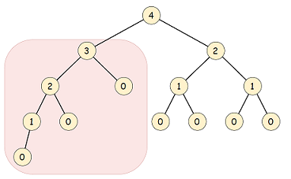
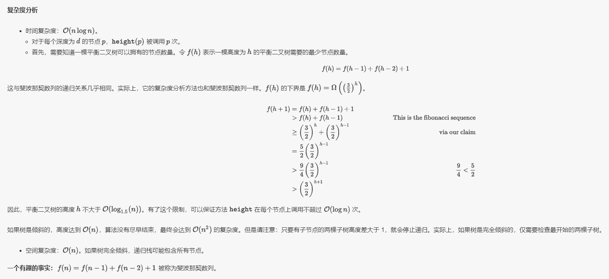

# 平衡二叉树

## :pencil2: 一、二叉搜索树

### 1、定义

* 每个节点中的值必须大于（或等于）存储在其左侧子树中的任何值。
* 每个节点中的值必须小于（或等于）存储在其右子树中的任何值。

### 2、验证二叉搜索树

#### [validate-binary-search-tree](https://leetcode-cn.com/problems/validate-binary-search-tree/)

给定一个二叉树，判断其是否是一个有效的二叉搜索树。

> 思路 1：中序遍历，检查结果列表是否已经有序
>
> 思路 2：分治法，判断 **左 MAX < 根 < 右 MIN，**&#x5982;果该二叉树的左子树不为空，则左子树上所有节点的值均小于它的根节点的值； 若它的右子树不空，则右子树上所有节点的值均大于它的根节点的值；它的左右子树也为二叉搜索树。



```cpp
bool isValidBST(TreeNode* root){
    if(root && !root->left && !root->right)
        return true;
    stack<TreeNode *> istack;
    TreeNode *ptr = root;
    long long last_val = (long long)INT_MIN - 1;  // 扩大int的范围，考虑边界值
    while(ptr || !istack.empty()){
        while(ptr) {
            istack.push(ptr);
            ptr = ptr->left;
        }
        TreeNode *curr_ptr = istack.top();
        if(curr_ptr->val <= last_val)
            return false;
        last_val = curr_ptr->val;
        istack.pop();
        ptr = curr_ptr->right;
    }
    return true;
}
```



```cpp
bool helper(TreeNode* root, long long lower, long long upper) {
    if(root == NULL)
        return true;
    if(root->val <= lower || root->val >= upper)
        return false;
    return helper(root->left, lower, root->val) 
                  && helper(root->right, root->val, upper);
}

bool isValidBST(TreeNode* root){
    return helper(root, LONG_MIN, LONG_MAX);
}
```



#### [balanced-binary-tree](https://leetcode-cn.com/problems/balanced-binary-tree/)

给定一个二叉树，判断它是否是高度平衡的二叉树。

> 一棵高度平衡二叉树定义为：一个二叉&#x6811;_&#x6BCF;个节点_ 的左右两个子树的高度差的绝对值不超过1。
>
> 根据定义，一棵二叉树 $$T$$ 存在节点 $$p\in T$$ ，满足 $$∣height(p.left)−height(p.right)∣>1$$ 时，它是不平衡的。下图中每个节点的高度都被标记出来，高亮区域是一棵不平衡子树。



> 方法一：**自顶向下的递归**
>
> 定义方法 $$height$$ ，用于计算任意一个节点 $$p\in T$$ 的高度：

$$
height(p)=\begin{cases} -1, & p\ \text{is an empty subtree i.e.} null \\ 1+max(height(p.left),height(p.right)), & \text{otherwise} \end{cases}
$$

> 接下来就是比较每个节点左右子树的高度。在一棵以  $$r$$ 为根节点的树 $$T$$ 中，只有每个节点左右子树高度差不大于 1 时，该树才是平衡的。因此可以比较每个节点左右两棵子树的高度差，然后向上递归。

```cpp
if (root == NULL)
    return true;
if (abs(height(root.left) - height(root.right)) > 1)
    return false;
else
    return isBalanced(root.left) && isBalanced(root.right);
```

<div align="left"></div>

> 方法二：**自底向上的递归**
>
> 方法一计算 height 存在大量冗余。每次调用 height 时，要同时计算其子树高度。但是自底向上计算，每个子树的高度只会计算一次。可以递归先计算当前节点的子节点高度，然后再通过子节点高度判断当前节点是否平衡，从而消除冗余。

```cpp
bool isBalancedTree(TreeNode *root, int &subHeight){
    if(!root){
        subHeight = 0;
        return true;
    }
    int x,y;
    bool bLeft = isBalancedTree(root->left, x);
    bool bRight = isBalancedTree(root->right, y);
    bool bIt = std::abs(x - y) > 1 ? false : true;
    subHeight = x > y ? x + 1 : y + 1;
    return bLeft && bRight && bIt;
}
bool isBalanced(TreeNode* root) {
    int height = 0;
    return isBalancedTree(root, height);
}
```

<div align="left"></div>

### 3、应用

#### [insert-into-a-binary-search-tree](https://leetcode-cn.com/problems/insert-into-a-binary-search-tree/)

给定二叉搜索树（BST）的根节点和要插入树中的值，将值插入二叉搜索树。 返回插入后二叉搜索树的根节点。 保证原始二叉搜索树中不存在新值。

```
```

#### [delete-node-in-a-bst](https://leetcode-cn.com/problems/delete-node-in-a-bst/)

给定一个二叉搜索树的根节点 root 和一个值 key，删除二叉搜索树中的 key 对应的节点，并保证二叉搜索树的性质不变。返回二叉搜索树（有可能被更新）的根节点的引用。

```
```

## :pencil2: 二、平衡二叉（搜索）树

### :pen\_fountain: 1、`AVL`树

平衡二叉树（Balanced Binary Tree）又被称为`AVL`树。它具有以下性质：它是一棵空树或它的左右两个子树的高度差的绝对值不超过1，并且左右两个子树都是一棵平衡二叉树。

一颗高度为n的平衡二叉树，需要的最少节点数为： $$F(n) = F(n - 1) + F (n - 2) + 1，F(1) = 1，F(2) = 2$$ 。

### :pen\_fountain: 2、红黑树

R-B Tree，全称是Red-Black Tree，又称为“红黑树”，它一种特殊的二叉查找树（**近似平衡的二路查找树**）。红黑树的每个节点上都有存储位表示节点的颜色，可以是红(Red)或黑(Black)。

:gem: **2.1、红黑树的特性**:

1. 每个节点或者是黑色，或者是红色。
2. 根节点是黑色。
3. 每个叶子节点（NIL）是黑色。 \[注意：这里叶子节点，是指为空(NIL或NULL)的叶子节点！]
4. 如果一个节点是红色的，则它的子节点必须是黑色的。
5. 从一个节点到该节点的子孙节点的所有路径上包含相同数目的黑节点。确保没有一条路径会比其他路径长出俩倍。因而，红黑树是相对是接近平衡的二叉树。

从性质5又可以推出：

* 性质5.1：如果一个结点存在黑子结点，那么该结点肯定有两个子结点

.png>)

&#x20;定理：**一棵含有n个节点的红黑树的高度至多为** $$2log_2(n+1)$$ **。**

#### :gem: 2.2、散列表、红黑树和跳表

散列表：插入删除查找都是 $$O(1)$$ ，是最常用的，但其缺点是不能顺序遍历，扩容缩容的性能损耗很大。适用于那些不需要顺序遍历，数据更新不那么频繁的场景。

跳表(Skip list)：插入删除查找都是 $$O(logn)$$ ，能顺序遍历，实现简单。缺点是空间复杂度为 $$O(n)$$ （磁盘IO相对比较频繁，因为要加载多级索引即重复多层节点），其顺序遍历和区间查找非常方便。

红黑树：插入删除查找都是 $$O(logn)$$ ，中序遍历即是顺序遍历，比较稳定。缺点是难以实现，区间查找不方便。
