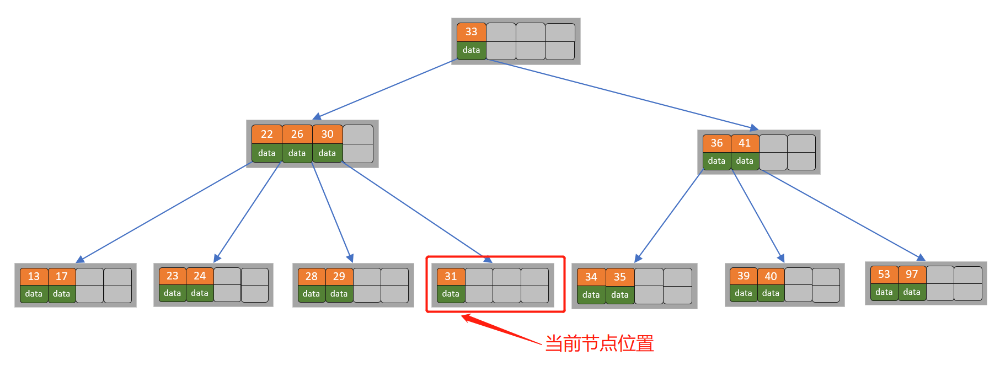

# 平衡多路搜索树

Ｂ树和Ｂ＋树的出现是因为磁盘ＩＯ；众所周知，ＩＯ操作的效率很低，那么，当在大量数据存储中，查询时我们不能一下子将所有数据加载到内存中，只能逐一加载磁盘页，每个磁盘页对应树的节点。造成大量磁盘ＩＯ操作（最坏情况下为树的高度）。平衡二叉树由于树深度过大而造成磁盘IO读写过于频繁，进而导致效率低下。所以，我们为了减少磁盘ＩＯ的次数，就你必须降低树的深度，将“瘦高”的树变得“矮胖”。一个基本的想法就是：

1. **每个节点存储多个元素**
2. **摒弃二叉树结构，采用多叉树**

这样就引出来了一个新的查找树结构 ——多路查找树（multi-way search tree）。 一颗平衡多路查找树自然可以使得数据的查找效率保证在`O(logN)`这样的对数级别上。

## :pencil2: &#x31;**、B树** 

### :pen\_fountain: **1.1、B树的定义** 

B数也称为B-树，他是一棵多路平衡查找树。我们描述一棵B树时需要指定它的阶数，阶数表示了一个节点最多有多少的孩子节点，一般使用字母m表示阶数。当m取2时，就是我们常见的二叉搜索树。

一棵m阶的B数定义如下：

1. 每个节点最多有`m-1`个关键字
2. 根节点最少可以只有一个关键字
3. 非根节点至少有`ceil(m/2)-1`个关键字
4. 每个节点的关键字都按照从小到大的顺序排列，每个关键字的左子树中的所有关键字都小于它，而右子树中的所有关键字都大于它
5. 所有叶子节点都位于同一层，或者说根节点到每个叶子节点的路径长度都相同

上图表示是一棵4阶B树（当然实际中B树的阶数一般远大于4，通常大于100，这样即使存储大量的数据，B树的高度仍然很低），每个节点最多有3个关键字，每个非根节点最少有`Math.ceil(4/2)-1`=1个关键字。我们将**一个key和其对应的data称为一个记录**。数据库中如果以B树作为索引结构，此时B树中的`key`就表示键，而`data`表示了这个键对应的条目在硬盘上的逻辑地址。

### :pen\_fountain: **1.2、B树的搜索操作** 

**以上图为例，比如我要查找关键字为25对应的数据，步骤如下**：

1. 首先拿到根节点关键字，目标关键字与根节点的关键字key比较，25<36，去往其左孩子节点查找
2. 获取当前节点的关键字15和28,15<25<28，所有查询15和28的中间孩子节点
3. 获取当前节点的关键字19和25，发现25=25，所以直接返回关键字和data数据（如果没有查询到则返回null）

### :pen\_fountain: 1.3、**B树的插入操作** 

插入操作是指插入**一条记录**，即（key, data）的键值对。如果B树中已存在需要插入的键值对，则用需要插入的**新data替换旧的data**。若B树不存在这个key，则一定是在**叶子节点**中进行插入操作。

#### **1.3.1 基本步骤** 

1. 根据key找到要插入的叶子节点位置，插入记录
2. 判断当前节点key的个数是否小于等于`m-1`，如果是直接结束，否则进行第三步
3. 以节点中间的key为中心分裂成左右两部分，然后将这个中间的key插入到父节点中，这个key的左子树指向分裂后的左半部分，这个key的右子支指向分裂后的右半部分，然后将当前节点指向父节点，继续进行第3步，直到处理完根节点。

#### **1.3.2 图文说明** 

以5阶B树为例（5阶B树节点最多有4个关键字，最少有2个关键字，其中根节点最少可以只有一个关键字），从初始时刻依次插入数据。

* 在空数中插入39

.png>)

* 继续插入22，97和41

.png>)

此时根节点有4个关键字

* 继续插入53

.png>)

此时发现该节点有5个关键字超过了最大允许的关键字个数4，所以以key为41为中心进行分裂，分裂后当前节点指向根节点，根节点的关键字为1，满足B数条件，插入操作结束，结果如下所示（注意，如果阶数是偶数，分裂时就不存在排序恰好在中间的key，那么我们选择中间位置的前一个key或中间位置的后一个key为中心进行分裂即可）

.png>)

* 插入13，21，40

.png>)

此时当前节点5个关键字，需要分裂，则以22为中心，22节点插入到其父节点中，分裂后当前节点指向根节点，根节点的关键字为2，满足B数条件，插入操作结束，结果如下所示

.png>)

* 同理依次输入30，27, 33 ，36，35，34 ，24，29，结果如下所示

.png>)

* 继续插入26

.png>)

此时节点关键字等于5，以27为中心分裂，并将27插入到父节点中，分裂后当前节点指向根节点，如下所示

.png>)

此时27的进位导致当前节点也需要分裂，则以33为中心进行分裂，结果如下

.png>)

* 7）同理最后再依次插入17，28，29，31，32，结果如下图所示

.png>)

#### **1.3.3 总结** 

一般来说，对于确定的m和确定类型的记录，节点大小是固定的，无论它实际存储了多少个记录。但是分配固定节点大小的方法会**存在浪费的情况**，比如key为28和29所在的节点，还有2个key的位置没有使用，但是已经不可能继续在插入任何值了，因为这个节点的前序key是27，后继key是30，所有整数值都用完了。所以如果记录先按key的大小排好序，再插入到B树中，节点的使用率就会很低，**最差情况下使用率仅为50%**。

### :pen\_fountain: 1.4、**B树的删除操作** 

**删除操作是指根据key删除记录，如果B树中的记录中不存对应key的记录，则删除失败。**

#### **1.4.1 基本步骤** 

1. 如果当前需要删除的key位于非叶子节点上，则用后继key（这里的后继key均指后继记录的意思）覆盖要删除的key，然后在后继key所在的子支中删除该后继key。此时后继key一定位于叶子节点上，这个过程和二叉搜索树删除节点的方式类似。删除这个记录后执行第2步
2. 该节点key个数大于等于`Math.ceil(m/2)-1`，结束删除操作，否则执行第3步。
3. 如果兄弟节点key个数大于`Math.ceil(m/2)-1`，则父节点中的key下移到该节点，兄弟节点中的一个key上移，删除操作结束。
4. 否则，将**父节点中的key下移与当前节点及它的兄弟节点中的key合并**，形成一个新的节点。原父节点中的key的两个孩子指针就变成了一个孩子指针，指向这个新节点。然后当前节点的指针指向父节点，重复上第2步。（有些节点它可能即有左兄弟，又有右兄弟，那么我们任意选择一个兄弟节点进行操作即可）

#### **1.4.2 图文说明** 

以5阶B树为例（5阶B树节点最多有4个关键字，最少有2个关键字，其中根节点最少可以只有一个关键字）。初始时刻以上述插入操作的最终状态为例。

* 初始状态

.png>)

* 删除节点21

.png>)

删除后节点中的关键字个数仍然大于等2，所以删除结束。

* 继续删除27，此时27由于是非叶子节点，则由它的后继节点28替换27，再删除28，结果如下所示

.png>)

此时发现叶子节点的个数小于2，而它的兄弟节点中有3个记录（当前节点还有一个右兄弟，选择右兄弟就会出现合并节点的情况，不论选哪一个都行，只是最后B树的形态会不一样而已），我们可以从兄弟节点中借取一个key。所以父节点中的28下移，兄弟节点中的26上移,删除结束。结果如下图所示

.png>)

* 删除32，结果如下图所示

当前节点中只有一个key，而兄弟节点中也仅有2个key。所以只能让**父节点中的30下移和这个两个孩子节点中的key合并**，成为一个新的节点，当前节点的指针指向父节点。结果如下图所示

.png>)

当前节点key的个数满足条件，故删除结束

* 接着删除key为40的记录，删除后结果如下图所示

.png>)

同理，当前节点的记录数小于2，兄弟节点中没有多余key，所以父节点中的key下移，和兄弟（这里我们选择左兄弟，选择右兄弟也可以）节点合并，合并后的指向当前节点的指针就指向了父节点。如下图所示

.png>)

同理，对于当前节点而言只能继续合并了，最后结果如下所示

.png>)

合并后节点当前节点满足条件，删除结束。

## :pencil2: 2、**B+树** 

### :pen\_fountain: 2.1、**B+树的定义** 

B+树是B树的一种变形形式。**网上各种资料上B+树的定义各有不同，一种定义方式是关键字个数和孩子节点个数相同。这里我们采取维基百科上所定义的方式，即关键字个数比孩子节点个数小1，这种方式是和B树基本等价的**。除了B树的性质，B+树还包括以下要求：

1. B+树包含2种类型的节点：**内部节点（也称索引节点）和**叶子节点。根节点本身即可以是内部节点，也可以是叶子节点。根节点的关键字个数最少可以只有1个。
2. B+树与B树最大的不同是**内部节点不保存数据**，**只用于索引**，所有数据（或者说记录）都**保存在叶子节点中**。
3. m阶B+树表示了**内部节点最多有m-1个关键字**（或者说内部节点最多有m个子树），阶数m同时限制了**叶子节点最多存储m-1个记录**。
4. 内部节点中的key都按照**从小到大**的顺序排列，对于内部节点中的一个key，左树中的所有key都**小于**它，右子树中的key都**大于等于**它。叶子节点中的记录也按照key的大小排列。
5. 每个**叶子节点都存有相邻叶子节点的指针**，叶子节点本身依关键字的大小自小而大顺序链接。

上图是一棵阶数为4的B+树

### :pen\_fountain: 2.2、**B+树的搜索操作** 

**操作流程同B树的搜索流程，只不过如果要找的关键字匹配上了索引节点的关键字，需要继续往下找，因为索引节点不存储数据，所有的数据都存储在叶子节点上。**

### :pen\_fountain: 2.3、**B+树的插入操作** 

#### **2.3.1 基本步骤** 

1. 若为空树，创建一个叶子节点，然后将记录插入其中，此时这个叶子节点也是根节点，插入操作结束。
2. 针对**叶子类型**节点：根据key值找到叶子节点，向这个叶子节点插入记录。插入后，若当前节点key的个数小于等于m-1，则插入结束。否则将这个叶子节点分裂成左右两个叶子节点，左叶子节点包含前m/2个记录，右节点包含剩下的记录，将第m/2+1个记录的key进位到父节点中（父节点一定是索引类型节点），进位到父节点的key左孩子指针向左节点,右孩子指针向右节点。将当前节点的指针指向父节点，然后执行第3步。
3. 针对**索引类型**节点：若当前节点key的个数小于等于m-1，则插入结束。否则，将这个索引类型节点分裂成两个索引节点，左索引节点包含前(m-1)/2个key，右节点包含m-(m-1)/2个key，将第m/2个key进位到父节点中，进位到父节点的key左孩子指向左节点, 进位到父节点的key右孩子指向右节点。将当前节点的指针指向父节点，然后重复第3步。

#### **2.3.2 图文说明** 

以5阶B+树为例（5阶B+树节点最多有4个关键字，最少有2个关键字，其中根节点最少可以只有一个关键字），从初始时刻依次插入数据。

* 在空树插入5

.png>)

* 依次插入8,10,15

.png>)

* 插入16

.png>)

此时节点超过关键字的个数，所以需要进行分裂。由于该节点为叶子节点，所以可以分裂出来左节点2个记录，右边3个记录，中间key成为索引节点中的key（也可以左节点3个记录，右节点2个记录），分裂后当前节点指向了父节点（根节点）。结果如下图所示

.png>)

当前节点的关键字个数满足条件，插入结束

* 插入17

.png>)

* 插入18

.png>)

当前节点超过关键字的个数，进行分裂。由于是叶子节点，分裂成两个节点，左节点2个记录，右节点3个记录，关键字16进位到父节点（索引类型）中，将当前节点的指针指向父节点，如下图所示

.png>)

当前节点的关键字个数满足条件，插入结束

* 同理继续插入6,9,19，细节不再描述

.png>)

* 继续插入7

.png>)

当前节点超过关键字的个数，进行分裂。由于是叶子节点，分裂成两个节点，左节点2个记录，右节点3个记录，关键字7进位到父节点（索引类型）中，将当前节点的指针指向父节点，如下图所示

.png>)

当前节点超过关键字的个数，进行分裂。由于是索引节点，左节点2个关键字，右节点2个关键字，关键字16进入到父节点中，将当前节点指向父节点，如下图所示

.png>)

当前节点的关键字个数满足条件，插入结束

### :pen\_fountain: 2.4、**B+树的删除操作** 

#### **2.4.1 基本步骤** 

如果叶子节点中没有相应的key，则删除失败。否则执行下面的步骤：

1. 删除叶子节点中对应的key。删除后若节点的key的个数大于等于`ceil(m-1)/2 – 1`，删除操作结束,否则执行第2步。
2. 若兄弟节点key有富余（大于`ceil(m-1)/2 – 1`），向兄弟节点借一个记录，同时用借到的key替换父结（指当前节点和兄弟节点共同的父节点）点中的key，删除结束。否则执行第3步。
3. 若兄弟节点中没有富余的key,则当前节点和兄弟节点合并成一个新的叶子节点，并删除父节点中的key（父节点中的这个key两边的孩子指针就变成了一个指针，正好指向这个新的叶子节点），将当前节点指向父节点（必为索引节点），执行第4步（第4步以后的操作和B树就完全一样了，主要是为了更新索引节点）。
4. 若索引节点的key的个数大于等于`ceil(m-1)/2 – 1`，则删除操作结束。否则执行第5步
5. 若兄弟节点有富余，父节点key下移，兄弟节点key上移，删除结束。否则执行第6步
6. 当前节点和兄弟节点及父节点下移key合并成一个新的节点。将当前节点指向父节点，重复第4步。

**注意，通过B+树的删除操作后，索引节点中存在的key，不一定在叶子节点中存在对应的记录。**

#### **2.4.2 图文说明** 

以5阶B树为例（5阶B树节点最多有4个关键字，最少有2个关键字，其中根节点最少可以只有一个关键字）。初始时刻以上述插入操作的最终状态为例。

* 初始状态

.png>)

* 删除22

.png>)

删除后叶子节点中key的个数大于等于2，删除结束

* 删除15

.png>)

当前节点只有一个key，不满足条件，而兄弟节点有三个key，可以从兄弟节点借一个关键字为9的记录,同时更新将父节点中的关键字由10也变为9，删除结束。

.png>)

* 删除7

.png>)

当前节点关键字个数小于2，（左）兄弟节点中的也没有富余的关键字（当前节点还有个右兄弟，不过选择任意一个进行分析就可以了，这里我们选择了左边的），所以当前节点和兄弟节点合并，并删除父节点中的key，当前节点指向父节点。

.png>)

此时当前节点的关键字个数小于2，兄弟节点的关键字也没有富余，所以父节点中的关键字下移，和两个孩子节点合并，结果如下图所示。

.png>)

删除结束。

> B+树的优点在于：&#x20;
>
> 1. 由于B+树在内部节点上不包含数据信息，因此在内存页中能够存放更多的key。 数据存放的更加紧密，具有更好的空间局部性。 因此访问叶子节点上关联的数据也具有更好的缓存命中率。&#x20;
> 2. B+树的叶子结点都是相链的，因此对整棵树的便利只需要一次线性遍历叶子结点即可。 而且由于数据顺序排列并且相连，所以便于区间查找和搜索。 而B树则需要进行每一层的递归遍历，相邻的元素可能在内存中不相邻，所以缓存命中性没有B+树好。
>
> 但是B树也有优点，其优点在于： 由于B树的每一个节点都包含key和value，因此经常访问的元素可能离根节点更近，因此访问也更迅速。

