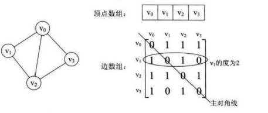
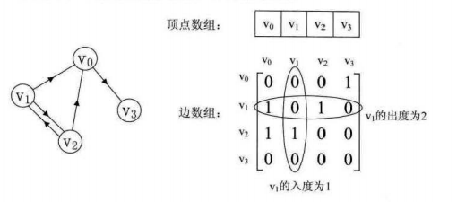
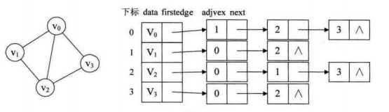
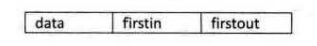
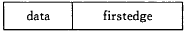
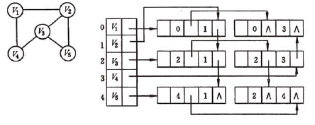

# 图

图中的概念很多，包括有向图和无向图、完全图和有向完全图、稀疏图和稠密图、入度和出度、路径和简单路径、回路（环）、（强）连通图和（强）连通分量、生成树和生成森林等，还有哈密顿图、欧拉图等又特殊性质的图。面试中考核的是两种搜索算法：深度优先搜索和广度优先搜索。

## :pencil2: 一、图的存储结构

图是由 $$(V,E)$$ 来表示的，对于无向图来说，其中 $$V=(v_0, v_1, \ldots, v_n)$$ ， $$E=\{ (v_i, v_j)(0\le i,j \le n\text{且}i\text{不等于}j)\}$$ ，对于有向图， $$E=\{<v_i, v_j>(0 \le i, j \le n\text{且}i\text{不等于}j)\}$$ 。**V**是顶点的集合，**E**是边的集合。

### :pen\_fountain: 1、邻接矩阵





* 无向图的邻接矩阵是对称矩阵，n个顶点的无向图需要 $$n\times(n+1)/2$$ 个空间大小
* 有向图的邻接矩阵不一定对称，n个顶点的有向图需要 $$n^2$$ 的存储空间
* 无向图中第 i 行的非零元素的个数为顶点 $$V_i$$ 的度
* 有向图中第 i 行的非零元素的个数为顶点 $$V_i$$ 的出度，第 i 列的非零元素的个数为顶点 $$V_i$$ 的入度

### :pen\_fountain: 2、邻接表



* 无向图顶点 Vi 的度为第 i 个单链表中的结点数
* 无向图中顶点 Vi 的出度为第 i 个单链表中的结点个数，顶点 Vi 的入度为全部单链表中连接点域值是 i 的结点个数
* 逆邻接表：有向图中对每个结点建立以 Vi 为头的弧的单链表

#### 邻接矩阵和邻接表

1. 在边稀疏（ $$e << n\times(n+1)/2$$ ）的情况下，用邻接表表示图比邻接矩阵节省存储空间，当与边相关的信息较多时更是如此&#x20;
2. 在邻接表上容易找到任何一顶点的第一个邻接点和下一个邻接点，但要判定任意两个顶点（ $$v$$ 和 $$v_1$$ ）之间是否有边或弧相连，则需搜索第 i 个或第 j 个链表，因此，不及邻接矩阵方便。&#x20;
3. 邻接表适合存无向图

### :pen\_fountain: 3、十字链表

边结点和顶点结点如下示：


其中`tailvex`是指弧起点在顶点表的下标，`headvex`是指弧终点在顶点表的下标。 `headlink`是指入边表指针域，指向终点相同的下一条边，`taillink`是指边表指针域，指向起点相同的下一条边。 如果是网，我们还要在其中加入权值域，来存储权值。



`firstin`表示入边表头指针，指向该顶点的入边表中第一个结点。 `firstout`表示出边表头指针，指向该顶点的出边表中第一个结点。


横向是出度，纵向是入度。

### :pen\_fountain: 4、邻接多重表

邻接多重表的结构和十字链表类似。边结点和顶点结点如下示：




边结点由6个域组成：`mark`为标志域，可标记这条边是否被搜索过； `ivex`和`jvex`为该边依附的两个顶点在图中的位置；`ilink`指向下一条依附于顶点`ivex`的边；`jlink`指向下一条依附于顶点`jvex`的边，`info`为指向和边相关的各种信息的指针域。顶点结点由2个域组成：`data`存储和该顶点相关的信息如顶点名称；`firstedge`域指示第一条依附于该顶点的边。



## :pencil2: 二、图的遍历

**深度优先搜索思想：**&#x5047;设初始状态是图中所有顶点均未被访问，则从某个顶点 v 出发，首先访问该顶点，然后依次从它的各个未被访问的邻接点出发深度优先搜索遍历图，直至图中所有和 v 有路径相通的顶点都被访问到。若此时尚有其他顶点未被访问到，则另选一个未被访问的顶点作起始点，重复上述过程，直至图中所有顶点都被访问到为止。

&#x20;**广度优先搜索思想：**&#x4ECE;图中某顶点 v 出发，在访问了 v 之后依次访问 v 的各个未曾访问过的邻接点，然后分别从这些邻接点出发依次访问它们的邻接点，并使得“先被访问的顶点的邻接点先于后被访问的顶点的邻接点被访问，直至图中所有已被访问的顶点的邻接点都被访问到。如果此时图中尚有顶点未被访问，则需要另选一个未曾被访问过的顶点作为新的起始点，重复上述过程，直至图中所有顶点都被访问到为止。

## :pencil2: 三、图的连通性

### :pen\_fountain: 1、无向图的双连通分量

设`G=(V,E)`是连通的无向图，如果V中顶点a是一个`关节点`，若 V 中有顶点`v,w`使得`v,w,a`各不相同且 v和 w 之间的每条路都包含 a。换言之，如果删除a和与之相邻的所有边时，就会把图的一个连通分量拆分成多个连通分量。而若对V中每个不同的三元组`v,w,a`，在v和w之间都存在一条不包含a的路径，则说G是`双连通`的。因此，仅当一个连通的无向图没有关节点时，它才是双连通的。

边`e1`和`e2`等价，若`e1=e2`或者有一条环路既包含`e1`又包含`e2`，则称边`e1`和`e2`是等价的。

假设 $$V_i$$ 是 $$E_i$$ 中各边都彼此连接的顶点集(或者利用边的等价性来划分等价类)，则每个图 $$G_i=(V_i, E_i)$$ 叫做 G 的一个**双连通分量**。

* 双连通分量是双连通的；
* 对所有的 $$i,j$$ (不相等)， $$V_i$$ 和 $$V_j$$ 最多一起包含一个顶点；
* 当且仅当 v 是 $$V_i$$ 和 $$V_j$$ 共同包含的顶点时，v 是 G 的一个关节点。

#### 求关节点

假设对连通无向图G进行深度优先搜索和深度优先编号，产生深度优先生成树 $$S=(V,T)$$ 和回退边 B。

> 性质：如果一个顶点 v 的真子孙的所有回退边都指向 v 或者比 v 更深层次(离树根更远)的顶点，则 v 是关节点。若有的回退边指向 v 的真祖先，则 v 不是关节点。

算法步骤：

* 对图进行深度优先搜索，计算每个顶点v的深度优先编号 `dfn[v]`，形成深度优先生成树
* 计算所有顶点 v 的`low[v]`编号是在深度优先生成树上按后根遍历顺序进行的。`low[v]`取下述三值的最小者：
  * `dfn[v]`
  * `dfn[w]`：存在回退边`(v,w)`的任何顶点 w
  * `low[y]`：y 是 v 的任意儿子
* 计算完`low`编号后，求关节点，根据性质，可知：
  * 树根只要有2个或更多的儿子，它就是关节点，显然
  * 非树根顶点 v 是关节点，当且仅当 v 有某个儿子 y，使`low[y] >= dfn[v]`，这里其实就是说其真子孙的回退边都指向 v 或者比 v 更深层次的顶点

### :pen\_fountain: 2、有向图的强连通分量

有向图的一个强连通分量是该图中顶点的一个最大子集：其中的任意两个顶点 x 和 y，存在 x 到 y 的路径，也存在 y 到 x 的路径。令 $$G=(V,E)$$ 是一个有向图，将V分割成若干等价类 $$V_i(l<=i<=r)$$ ，使得 $$V_i$$ 中的 v 和 w 等价的充要条件是有一条路径从 v 到 w，也存在一条路径从 w 到 v。令 $$E_i(l\le i\le r)$$ 是头、尾均在 $$V_i$$ 的边集，则 $$G_i=(V_i, E_i)$$ 是 G 的**强连通分量**，简称强分量。把只具有一个强连通分量的有向图称为**强连通图**。

连接两个强分量的边叫做`分支横边`。通过构造G的**归约图** ，可以展示各强分量间的联系。归约图中每个强分量用一个顶点表示，显然，归约图中不存在环路。


`Kosaraju`算法步骤：

* 对有向图 G 进行深度优先搜索并且对顶点进行**逆编号**(即记录它们的离开时间)。
* 将 G 中的每条边取反方向，构造一个新有向图 Gr。
* 根据前面的编号，从编号最大的顶点开始对 G，进行一次深度优先搜索，凡是能到达的所有顶点，都形成一棵深度优先搜索树；若本次搜索没有到达所有顶点，从图中删除这些顶点及相连的边，继续重复该动作。
* 在 Gr 的深度优先森林中，每棵树对应 G 的一个强连通分量。

_**图的连通性判断方法主要有：并查集、****`DFS`****、****`BFS`****、****`WARSHALL`****。**_

## :pencil2: 四、最短路径

最短路径树（SPT）：在加权有向图中，有一个顶点 s，以 s 为起点的最短路径树是图的一幅子图，包含 s 和从 s 到达的所有顶点。这棵树的根结点是 s，树的每条路径都是有向图中的一条最短路径。

### :pen\_fountain: 1、`Dijkstra`

Dijkstra单源最短路径算法，即计算从起点出发到每个点的最短路径。所以Dijkstra常常作为其他算法的预处理，使用邻接矩阵的时间复杂度为 $$O(n^2)$$ ，用优先队列的复杂度为 $$O((m+n)logn)$$ ，近似为 $$O(mlogn)$$ 。

基本思想：每次找到离源点（如1号结点）最近的一个顶点，然后以该顶点为中心进行扩展，最终得到源点到其余所有点的最短路径。&#x20;

基本步骤：

1. 设置标记数组`book[]`：将所有的顶点分为两部分，已知最短路径的顶点集合 P 和未知最短路径的顶点集合 Q，很显然最开始集合 P 只有源点一个顶点。 $$book[i]$$ 为 1 表示在集合 P 中；&#x20;
2. 设置最短路径数组 $$dst[]$$ 并不断更新：初始状态下，令 $$dst[i] = edge[s][i]$$ ，很显然此时 $$dst[s]=0$$ ， $$book[s]=1$$ 。此时，在集合 Q 中可选择一个离源点 s 最近的顶点 u 加入到 P 中。并依据以u为新的中心点，对每一条边进行松弛操作(松弛是指由结点 $$s->j$$ 的途中可以经过点 u，并令 $$dst[j]=min\{dst[j], dst[u]+edge[u][j]\}$$ )，并令 $$book[u]=1$$ ；
3. 在集合 Q 中再次选择一个离源点 s 最近的顶点 v 加入到 P 中。并依据 v 为新的中心点，对每一条边进行松弛操作(即 $$dst[j]=min\{dst[j], dst[v]+edge[v][j]\}$$ )，并令 $$book[v]=1$$ ；
4. 重复3，直至集合 Q 为空。（[题目链接](http://hihocoder.com/problemset/problem/1081)）

```cpp
#include <vector>
#include <iostream>
using namespace std;

const int MAX_LEN = 10001;

// 最短路径长度 Dijkstra
void Dijkstra(int N, int S, vector<int>& dst, vector<vector<int>>& graph){
    vector<bool> book(N + 1, false);
    book[S] = true;
    for(int i = 1; i <= N; ++i)
        dst[i] = graph[S][i];
    dst[S] = 0;
    // 迭代 N - 1 次
    for(int i = 1; i < N ; ++i){
        int u = S;
        int tmp = MAX_LEN;
        // 找 u
        for(int j = 1; j <= N; ++j){
            if(!book[j] && tmp > dst[j]){
                tmp = dst[u = j];
            }
        }
        if(tmp == MAX_LEN)
			      break;	
        // 松弛边
        book[u] = true;
        for(int j = 1; j <= N; ++j){
            if(!book[j] && graph[u][j] != MAX_LEN){
                int d = dst[u] + graph[u][j];
                if(d < dst[j])
                    dst[j] = d;
            }
        }
    }
}

int main(void){
    int N = 0, M = 0, S = 0, T = 0;
    while(cin >> N >> M >> S >> T){
        vector<int> dst(N + 1, MAX_LEN);
        vector<vector<int>> graph(N + 1, vector<int>(N + 1, MAX_LEN));
        int u, v, len;
        while(M-- > 0){
            cin >> u >> v >> len;
            if(len < graph[u][v]){
                graph[u][v] = graph[v][u] = len;
            }
        }
        Dijkstra(N, S, dst, graph);
        cout << dst[T] << endl;
    }
    return 0;
}
```

### :pen\_fountain: 2、`SPFA`（bellman-ford）

`SPFA`是bellman-ford的改进算法(队列实现），效率也更高，故直接介绍`SPFA`。 相比于`Dijkstra`，`SPFA`可以计算带负环的回路。 邻接表的复杂度为： $$O(kE)$$ 。E 为边数，k 一般为2或3。

bellman-ford算法的基本思想是，对图中除了源顶点 s 外的任意顶点 u，依次构造从 s 到 u 的最短路径长度序列 $$dist[u], dis2[u], \ldots, dis(n-1)[u]$$ ，其中 n 是图 G 的顶点数，`dis1[u]`是从 s 到 u 的只经过 1条边的最短路径长度，`dis2[u]`是从 s 到 u 的最多经过 G 中2条边的最短路径长度，当图 G 中没有从源可达的负权图时，从 s 到 u 的最短路径上最多有 $$n-1$$ 条边。因此， `dist(n-1)[u]`就是从 s 到 u 的最短路径长度，显然，若从源 s 到 u 的边长为 $$e(s,u)$$ ，则 $$dis1[u]=e(s,u)$$ 。对于 $$k>1$$ ，`dis(k)[u]`满足如下递归式， $$dis(k)[u]=min\{dis(k-1)[v]+e(v,u)\}$$ 。bellman-ford最短路径就是按照这个递归式计算最短路的。&#x20;

`SPFA`的实现如下：用数组dis记录更新后的状态，`cnt`记录更新的次数，队列 q 记录更新过的顶点，算法依次从 q 中取出待更新的顶点 v，按照 $$dis(k)[u]$$ 的递归式计算。在计算过程中，一旦发现顶点 K 有 $$cnt[k]>n$$ ，说明有一个从顶点 K 出发的负权圈，此时没有最短路，应终止算法。否则，队列为空的时候，算法得到 G 的各顶点的最短路径长度。

### :pen\_fountain: 3、`floyd`

全称`Floyd-Warshall`。在离散数学里叫做`Warshall`算法，用来计算传递闭包。这个算法用于求所有点对的最短距离。比调用 n 次`dijkstra`的优点在于代码简单。 时间复杂度为 $$O(n^3)$$ 。

## :pencil2: 五、最小生成树

最小生成树有两个经典算法：

* `Prim` 算法
* `Kruskal` 算法

如果一幅图是非连通的，则只能用这个算法计算所有连通分量的最小生成树，合并在一起叫做**最小生成森林**。还有几点要注意的：

* 边的权重未必是距离。
* 边的权重可能小于等于 0 。
* 所有边的权重都可能相同也可能不相同。

两个性质：

* 用一条边连接树中的任意两个顶点都会产生一个新的环。
* 从树中删去一条边可以得到两棵独立的树。\
  

图的一种切分是把图的所有顶点分为两个 非空 且 不重复 的集合。横切片是一条连接两个属于不同集合的边。通常，我们指定一个顶点集，然后隐式地认为它的补集是另一个顶点集。给定任意的切分，它的横切边中的权重最小者必然属于图的最小生成树。假设所有边的权重不相同，则每幅连通图都只有唯一的最小生成树。

### :pen\_fountain: 1、**Prim算法**

Prim算法能够得到任意加权无向图的最小生成树。每一步都会为成长中的树加一条边。

Lazy实现：


* 首先初始化权重矩阵；
* 初始化起始点到可达顶点的距离数组，并标记起始点已访问，找出起始点到可达结点的代价最小的边，将这个边加入 sum，这条边对应一个可达顶点，设置这个顶点已访问`visited[pos] = true`。
* 再到 graph 中去找该顶点可达的顶点（未被访问且当前距离大于新的距离；`!visited[i] && distance[i] > G[pos][i]`），那么更新这个当前距离（因为要取代价小的边），否则不更新；
* 由于除去起始点本身，所以循环 `N - 1` 次。（[题目链接](http://hihocoder.com/problemset/problem/1097?sid=1402285)）

```cpp
#include <iostream>
#include <vector>
using namespace std;

const int MAX_LEN = 100001;

int Prim(int N, std::vector<int>& dst, std::vector<std::vector<int>>& graph){
    vector<bool> visited(N + 1, false);
    visited[1] = true;
    for(int i = 1; i <= N; ++i) {
        dst[i] = graph[1][i];
    }
    int result = 0;
    for(int i = 1; i < N; ++i){
        int tmp = MAX_LEN;
        int u = 1;
        for(int j = 1; j <= N; ++j){
            if(!visited[j] && tmp > dst[j]){
                tmp = dst[u = j];
            }
        }
        if(tmp == MAX_LEN)
            break;
        visited[u] = true;
        result += tmp;
        for(int j = 1; j <= N; ++j){
            if(!visited[j] && dst[j] > graph[u][j]){
                dst[j] = graph[u][j];
            }
        }
    }
    return result;
}

int main(){
    int N = 0;
    while(cin >> N){
        int val = 0;
        vector<vector<int>> graph(N + 1, vector<int>(N + 1, MAX_LEN));
        for(int i = 1; i <= N; ++i){
            for(int j = 1; j <= N; ++j){
                cin >> val;
                graph[i][j] = val;
            }
        }
        vector<int> dst(N + 1, MAX_LEN);
        cout << Prim(N, dst, graph) << endl;
    }
    return 0;
}
```

Eager实现：


### :pen\_fountain: 2、**`Kruskal` 算法**

`Kruskal` 算法的思想是按照边的权重顺序（从小到大）加入到树中，加入的边不会构成环。


（[题目链接](http://hihocoder.com/problemset/problem/1098?sid=1584302)）



```cpp
#include <iostream>
#include <vector>
#include <algorithm>
#include <functional>
#include <memory>

using namespace std;

struct Edge{
    int st;
    int ed;
    int cost;
    Edge(int s, int e, int c) : st(s), ed(e), cost(c) {}
};

int Kruscal(std::vector<int>& trees, std::vector<Edge>& graph){
    int result = 0;
    auto recursiveFunc = 
                  std::make_shared<std::unique_ptr< std::function<int(int)> >>();
    *recursiveFunc = std::make_unique<std::function<int(int)>>(
        [=, &trees] (int a){
            return a == trees[a] ? a : (trees[a] = (**recursiveFunc)(trees[a]));
        }
    );
    for(auto edge : graph){
        if((**recursiveFunc)(edge.st) != (**recursiveFunc)(edge.ed)){
            result += edge.cost;
            trees[(**recursiveFunc)(edge.st)] = (**recursiveFunc)(edge.ed);
        }
    }
    return result;
}

int main(){
    int N = 0, M = 0;
    int N1, N2, V;
    while(cin >> N >> M){
        vector<Edge> graph;
        while(M-- > 0){
            cin >> N1 >> N2 >> V;
            Edge edge(N1, N2, V);
            graph.push_back(edge);
        }
        // 排序
        sort(graph.begin(), graph.end(), 
             [](const Edge& a, const Edge& b)->bool {return a.cost < b.cost; });
        vector<int> root(N + 1);
        for(int i = 1; i <= N; ++i){
            root[i] = i;
        }
        cout << Kruscal(root, graph) << endl;
    }
    return 0;
}
```



```cpp
#include <iostream>
#include <vector>
#include <algorithm>
#include <functional>
#include <memory>

using namespace std;

struct Edge{
    int st;
    int ed;
    int cost;
    Edge(int s, int e, int c) : st(s), ed(e), cost(c) {}
};

int Kruscal(std::vector<int>& trees, std::vector<Edge>& graph){
    int result = 0;
    auto recursiveFunc = std::shared_ptr<std::unique_ptr< std::function<int(int)> >>
                         (new std::unique_ptr< std::function<int(int)> >());
    *recursiveFunc = std::unique_ptr<std::function<int(int)>>( 
        new std::function<int(int)>(
            [=, &trees] (int a){
                return a == trees[a] ? a : (trees[a] = (**recursiveFunc)(trees[a]));
            }
        )
    );
    for(auto edge : graph){
        if((**recursiveFunc)(edge.st) != (**recursiveFunc)(edge.ed)){
            result += edge.cost;
            trees[(**recursiveFunc)(edge.st)] = (**recursiveFunc)(edge.ed);
        }
    }
    return result;
}

int main(){
    int N = 0, M = 0;
    int N1, N2, V;
    while(cin >> N >> M){
        vector<Edge> graph;
        while(M-- > 0){
            cin >> N1 >> N2 >> V;
            Edge edge(N1, N2, V);
            graph.push_back(edge);
        }
        // 排序
        sort(graph.begin(), graph.end(), 
             [](const Edge& a, const Edge& b)->bool {return a.cost < b.cost; });
        vector<int> root(N + 1);
        for(int i = 1; i <= N; ++i){
            root[i] = i;
        }
        cout << Kruscal(root, graph) << endl;
    }
    return 0;
}
```



```cpp
#include <iostream>
#include <vector>
#include <algorithm>

using namespace std;

struct Edge{
    int st;
    int ed;
    int cost;
    Edge(int s, int e, int c) : st(s), ed(e), cost(c) {}
};

int Find(std::vector<int>& pre, int x){
    return x == pre[x] ? x : pre[x] = Find(pre, pre[x]);
}

void Union(std::vector<int>& pre, int x,int y){
    pre[Find(pre, x)] = Find(pre, y);
}

int Kruscal(std::vector<int>& trees, std::vector<Edge>& graph){
    int result = 0;
    for(auto edge : graph){
        if(Find(trees, edge.st) != Find(trees, edge.ed)){
            result += edge.cost;
            Union(trees, edge.st, edge.ed);
        }
    }
    return result;
}

int main(){
    int N = 0, M = 0;
    int N1, N2, V;
    while(cin >> N >> M){
        vector<Edge> graph;
        while(M-- > 0){
            cin >> N1 >> N2 >> V;
            Edge edge(N1, N2, V);
            graph.push_back(edge);
        }
        // 排序
        sort(graph.begin(), graph.end(), 
             [](const Edge& a, const Edge& b)->bool {return a.cost < b.cost; });
        vector<int> root(N + 1);
        for(int i = 1; i <= N; ++i){
            root[i] = i;
        }
        cout << Kruscal(root, graph) << endl;
    }
    return 0;
}
```



## :pencil2: 六、拓扑排序【[链接](https://leetcode-cn.com/problems/course-schedule/)】

对一个**有向无环图**（`Directed Acyclic Graph`简称DAG）G进行拓扑排序，是将G中所有顶点排成一个线性序列，使得图中任意一对顶点u和v，若边 $$<u,v>∈E(G)$$ ，则u在线性序列中出现在v之前。通常，这样的线性序列称为满足拓扑次序（Topological Order）的序列，简称拓扑序列。简单的说，由某个集合上的一个偏序得到该集合上的一个全序，这个**操作称之为拓扑排序**。

有向图的拓扑排序的基本思想是：首先在有向图中选取一个没有前驱（入度为0）的顶点，将其输出，从有向图中删除该顶点，并且删除以该顶点为尾的所有有向图的边。重复以上的步骤，直到图中的所有顶点均输出或是图中的顶点均没有前驱为止。对于后者，说明有向图中存在环，不能进行拓扑排序。

### :pen\_fountain: 1、`BFS`

`BFS`算法又称`Kahn`算法，该算法需要维护一个入度为0的顶点的集合，每次从该集合中取出（没有特殊的取出规则，随机取出也行，使用队列/栈也行，下同）一个顶点，将该顶点放入结果序列中。紧接着循环遍历由该顶点引出的所有边，从图中移除这条边，同时获取该边的另外一个顶点，如果该顶点的入度在减去本条边之后为0，那么也将这个顶点放到入度为0的集合中。然后继续从集合中取出一个入度为0的顶点，重复上述的操作。当集合为空之后，检查图中是否还存在任何边，如果存在的话，说明图中至少存在一条环路。不存在的话则返回结果List，此List中的顺序就是对图进行拓扑排序的结果。

```cpp
std::vector<int> topologicalSort_bfs(int n, std::vector<std::pair<int, int> >& edges){
    vector<int> res;
    queue<int> iqueue;
    int in_degree[n];
    memset(in_degree, 0, sizeof in_degree);
    for(auto edge : edges){
        in_degree[edge.second]++;
    }
    for(int i = 0; i < n; ++i){
        if(in_degree[i] == 0)
            iqueue.push(i);
    }
    while(!iqueue.empty()){
        int tmp = iqueue.front();
        iqueue.pop();
        res.push_back(tmp);
        for(int i = 0; i < edges.size(); ++i){
            if(edges[i].first == tmp){
                in_degree[edges[i].second]--;
                if(in_degree[edges[i].second] == 0)
                    iqueue.push(edges[i].second);
            }
        }
    }
    return res.size() == n ? res : vector<int>();
}
```

### :pen\_fountain: 2、`DFS`

利用`DFS`实现拓扑排序，需要使用栈结构来维护一个出度为0的顶点的集合。添加顶点到结果集中的时机是在`DFS`方法即将退出之时，`DFS`方法本身是个递归方法，只要当前顶点还存在边指向其它任何顶点，它就会递归调用`DFS`方法，而不会退出。因此，退出`DFS`方法，意味着当前顶点没有指向其它顶点的边了，即当前顶点是一条路径上的最后一个顶点。

```cpp
void dfs(vector<vector<int> >&v, stack<int> &s, int *isVisited, int u, bool &isCircled){
    if(isCircled)
        return;
    isVisited[u] = -1;
    for(int i = 0; i < v[u].size(); ++i){
        if (isVisited[v[u][i]] == 0) {
            dfs(v, s, isVisited, v[u][i], isCircled);
        }else if(isVisited[v[u][i]] == -1){
            isCircled = true;
            return;
        }
    }
    isVisited[u] = 1;
    s.push(u);
}
std::vector<int> topologicalSort_dfs(int n, std::vector<std::pair<int, int> >& edges){
    vector<int> res;
    stack<int> istack;
    int isVisited[n]; // 0为未访问，1为已访问，-1为正在访问，当dfs搜索时遇到了
                      // 一条边终止顶点对应的isVisited元素为-1时，就说明图中有环了
    memset(isVisited, 0, sizeof isVisited);
    vector<vector<int> > v_edges(n);
    for(auto edge : edges) {
        v_edges[edge.second].push_back(edge.first);
    }
    bool isCircled = false;
    for(int i = 0; i < n; ++i){
        if(!isVisited[i])
            dfs(v_edges, istack, isVisited, i, isCircled);
        if(isCircled)
            break;
    }
    if (isCircled)
        return vector<int>();
    while(!istack.empty()){
        res.push_back(istack.top());
        istack.pop();
    }
    return res;
}
```

#### **两种实现算法的总结：**

这两种算法分别使用链表和栈来表示结果集。对于基于DFS的算法，加入结果集的条件是：顶点的出度为0。而Kahn算法中入度为0的顶点集合为结果集。一个是从入度的角度来构造结果集，另一个则是从出度的角度来构造。二者的复杂度均为 $$O(V+E)$$ 。

#### **实现上的一些不同之处：**

Kahn算法不需要检测图为DAG，如果图为DAG，那么在出度为0的集合为空之后，图中还存在没有被移除的边，这就说明了图中存在环路。而基于DFS的算法需要首先确定图为DAG，当然也能够做出适当调整，让环路的检测和拓扑排序同时进行，毕竟环路检测也能够在DFS的基础上进行。（上述代码也是这样做的）

### :pen\_fountain: 3、题型

[**Course Schedule**](https://leetcode-cn.com/problems/course-schedule/)

```cpp
bool canFinish(int numCourses, vector<vector<int>>& prerequisites) {
    vector<int> res;
    queue<int> iqueue;
    int in_degree[numCourses];
    memset(in_degree, 0, sizeof in_degree);
    for(auto edge : prerequisites){
        in_degree[edge[1]]++;
    }
    for(int i = 0; i < numCourses; ++i){
        if(in_degree[i] == 0)
            iqueue.push(i);
    }
    while(!iqueue.empty()){
        int tmp = iqueue.front();
        iqueue.pop();
        res.push_back(tmp);
        for(int i = 0; i < prerequisites.size(); ++i){
            if(prerequisites[i][0] == tmp){
                in_degree[prerequisites[i][1]]--;
                if(in_degree[prerequisites[i][1]] == 0)
                    iqueue.push(prerequisites[i][1]);
            }
        }
    }
    return res.size() == numCourses ? true : false;
}
```

#### [Course Schedule II](https://leetcode-cn.com/problems/course-schedule-ii/)&#x20;

```cpp
void dfs(vector<vector<int> >&v, stack<int> &s, int *isVisited, int u, bool &isCircled){
    if(isCircled)
        return;
    isVisited[u] = -1;
    for(int i = 0; i < v[u].size(); ++i){
        if (isVisited[v[u][i]] == 0) {
            dfs(v, s, isVisited, v[u][i], isCircled);
        }else if(isVisited[v[u][i]] == -1){
            isCircled = true;
            return;
        }
    }
    isVisited[u] = 1;
    s.push(u);
}
vector<int> findOrder(int numCourses, vector<vector<int>>& prerequisites) {
    vector<int> res;
    stack<int> istack;
    int isVisited[numCourses]; 
    memset(isVisited, 0, sizeof isVisited);
    vector<vector<int> > v_edges(numCourses);
    for(auto edge : prerequisites) {
        v_edges[edge[1]].push_back(edge[0]);
    }
    bool isCircled = false;
    for(int i = 0; i < numCourses; ++i){
        if(!isVisited[i])
            dfs(v_edges, istack, isVisited, i, isCircled);
        if(isCircled)
            break;
    }
    if (isCircled)
        return vector<int>();
    while(!istack.empty()){
        res.push_back(istack.top());
        istack.pop();
    }
    return res;
}
```

#### [Longest Increasing Path in a Matrix](https://leetcode-cn.com/problems/longest-increasing-path-in-a-matrix/)

#### [P4017 最大食物链计数](https://www.luogu.org/problemnew/show/P4017)

#### [P1038 神经网络](https://www.luogu.org/problemnew/show/P1038)

#### [P1983 车站分级](https://www.luogu.org/problemnew/show/P1983)

#### [P1137 旅行计划](https://www.luogu.org/problemnew/solution/P1137)

#### [P3243 菜肴制作](https://www.luogu.org/problemnew/show/P3243)

#### [P1113 杂务](https://www.luogu.com.cn/problem/P1113)

## :pencil2: 七、例题

### [Clone Graph](http://blog.csdn.net/linhuanmars/article/details/22715747)

### &#x20;[Word Ladder](http://blog.csdn.net/linhuanmars/article/details/23029973)

### &#x20;[Word Ladder II](http://blog.csdn.net/linhuanmars/article/details/23071455)

### &#x20;[Longest Consecutive Sequence](http://blog.csdn.net/linhuanmars/article/details/22964467)

### &#x20;[Word Search](http://blog.csdn.net/linhuanmars/article/details/24336987)

### &#x20;[Surrounded Regions](http://blog.csdn.net/linhuanmars/article/details/22904855)
