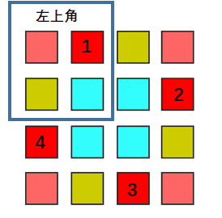

# 数组 & 矩阵

## :pencil2: 数组

### :pen\_fountain: 1、[**数组中出现次数超过一半的数字**](https://leetcode-cn.com/problems/shu-zu-zhong-chu-xian-ci-shu-chao-guo-yi-ban-de-shu-zi-lcof/)

数组中有一个数字出现的次数超过数组长度的一半，请找出这个数字。

> 方法一：哈希表
>
> 方法二：摩尔投票



```cpp
int majorityElement(vector<int>& nums) {
    int len = nums.size();
    unordered_map<int, int> imap;
    for(int num : nums){
        imap[num]++;
        if(imap[num] > len / 2)
            return num;
    }
    return 0;
}
```



```cpp
int majorityElement(std::vector<int>& nums){
    int votes = 0;
    int num = nums[0];
    for(int i = 1; i < nums.size(); ++i){
        votes = nums[i] != num ? votes - 1 : votes + 1;
        if(votes < 0){
            num = nums[i];
            votes = 0;
        }
    }
    return num;
}
```



### :pen\_fountain: **2、**[**部分排序**](https://leetcode-cn.com/problems/sub-sort-lcci/)

给定一个整数数组，编写一个函数，找出索引m和n，只要将索引区间\[m,n]的元素排好序，整个数组就是有序的。注意：n-m尽量最小，也就是说，找出符合条件的最短序列。函数返回值为\[m,n]，若不存在这样的m和n（例如整个数组是有序的），请返回\[-1,-1]。

> 方法一：将原数组复制一份后排序，和原数组两头比较。时间复杂度 $$O(nlogn)$$ 空间复杂度 $$O(n)$$&#x20;
>
> 方法二：一趟遍历+双指针。时间复杂度 $$O(n)$$ 空间复杂度 $$O(1)$$&#x20;
>
> 1. 从前向后扫描数组，判断当前`array[i]`是否比`max`小，是则将`right`置为当前`array`下标`i`，否则更新`max`；
> 2. 从后向前扫描数组，判断当前`array[len - 1 - i]`是否比`min`大，是则将`left`置位当前下标`len - 1 - i`，否则更新`min`；
> 3. 返回`{left， right}`。



```cpp
vector<int> subSort(vector<int>& array) {
    vector<int> tmp = array;
    sort(tmp.begin(), tmp.end());
    int left = -1, right = -1;
    for(int i = 0; i < array.size(); i++){
        if(tmp[i] != array[i]){
            if(left == -1)
                left = i;
            right = i;
        }
    }
    return vector<int>{left, right};
}
```



```cpp
vector<int> subSort(vector<int>& array) {
    int left = -1, right = -1;
    int max_val = INT_MIN;
    int min_val = INT_MAX;
    int len = array.size();
    for(int i = 0; i < len; i++){
        if(array[i] < max_val){
            right = i;
        }else{
            max_val = max(max_val, array[i]);
        }
        if(array[len - i - 1] > min_val){
            left = len - i - 1;
        }else{
            min_val = min(min_val, array[len - i - 1]);
        }
    }
    return vector<int>{left, right};
}
```



### :pen\_fountain: **3、**[数组中未出现的最小正整数](https://www.nowcoder.com/questionTerminal/030cabe03d94484c819e87c2e38c41bd?answerType=1\&amp;f=discussion)

给定一个无序数组arr，找到数组中未出现的最小正整数&#x20;

例如`arr = [-1, 2, 3, 4]`，返回1；`arr = [1, 2, 3, 4]`，返回5。

\[要求] 时间复杂度为 $$O(n)$$ ，空间复杂度为 $$O(1)$$ 。

> 一、暴力法：最容易想到的就是从 1 开始找，时间复杂度为 $$O(m*n)$$ ，m 为`max(arr[i])`。其次就是排序后从头开始找，时间复杂度 $$O(nlogn)$$ 。
>
> 二、空间复杂度算法：新开辟一个数组，元素初始化为0。把原来的数组中的数字放到新的数组中，放置的位置要合适，也就是要在这样合适的位置（`idx=arr[i] - 1`）。如果这个数小于 1 或者大于数组的长度，就把这个数忽略掉，不放到新的数组中。完成之后，从头到尾遍历新的数组，找到第一个值不等于下标+1的数，下标+1就是那个未出现的最小正整数。
>
> 三、缩减空间复杂度：直接在原数组上修改位置，`left`表示在`[1~left]`的正整数已经找到了合适的位置，`left`的初值为0；上面的算法中，如果一个数字太大了，就会被扔掉。这里用`right`表示这个边界，如果大于这个`right`的数就会被扔掉。`right`的初值为N表示`[1-right]`的元素都不会被扔掉， 大于`right`的就会被扔掉。但是这个`right`的值是变化的，如果`[left+1~right]`中有一个元素不合法，那么这个`right`就是减少1，因为最多已经不能放下`[1~right]`了，最多只能放下`[1~right-1]`了。



```cpp
int findMin(std::vector<int> &arr){
    int left = 0, right = arr.size();
    while(left < right){
        int tmp = arr[left];
        if(tmp == left + 1){
            left++;
        }else if(tmp < left + 1 || tmp > right || arr[tmp - 1] == tmp){
            right--;
            arr[left] = arr[right];
        }else{
            swap(arr[left], arr[tmp - 1]);
        }
    }
    return left + 1;
}
```



```cpp
int findMin(std::vector<std::vector<int> > &arr){
    int rlen = arr.size();
    int clen = arr[0].size();
    int left = 0, right = rlen * clen;
    while(left < right){
        int tmp = arr[left / clen][left % clen];
        if(tmp == left + 1){
            left++;
        }else if(tmp < left + 1 || tmp > right || 
                 arr[(tmp - 1) / clen][(tmp - 1) % clen] == tmp){
            right--;
            arr[left / clen][left % clen] = arr[right / clen][right % clen];
        }else{
            swap(arr[left / clen][left % clen], 
                 arr[(tmp - 1) / clen][(tmp - 1) % clen]);
        }
    }
    return left + 1;
}
```



### :pen\_fountain: 4、整除k的最大子集合（网易笔试题）

有一个整数集合，返回能被k整除的子集合的最大和，如果找不到则返回-1。如：{7, 3, 1, 4}，输出14=7+3+4。

```cpp
int maxSumDivSeven(vector<int>& nums, int k) {
    vector<int> dp(k, INT_MIN);
    dp[0] = 0;
    for (auto a : nums) {
        vector<int>dpNext(k, 0);
        int mod = a % k;
        for (int i = 0; i < k; ++i) {
            dpNext[i] = max(dp[i], dp[(k + i - mod) % k] + a);
        }
        dp = dpNext;
    }
    return dp[0];
}
```

### :pen\_fountain: 5、多个整数拼接成最大整数

输入n个正整数，要求把他们拼接成最大的整数输出。

举例：

输入3， 30  拼接成的最大整数是：330

输入1, 3, 30， 305, 346， 5， 58， 8    拼接成最大整数是： 85853463305301

> 思路：关键是要把其转换为数组排序的问题，而这个排序的规则怎么定义呢？&#x20;
>
> 给你任意两个整数，设计一个比较规则，让其组成的整数最大。比如a和b两个整数，把他们两个分别前后拼接成两个整数，再比较一下大小之后就知道谁大谁小了。举个例子就是3和30这两个整数；用字符串拼接起来分别是303和330；然后转换为整数再比较一次，发现330比303大，也就是3拼在30前面比较大，那么就是说3比30要大。

```cpp
bool compare(const int& a, const int& b)
{
    //从大到小排序，使用字符串拼接
    return atoi((to_string(a) + to_string(b)).data()) 
                > atoi((to_string(b) + to_string(a)).data());
}
string getMaxNum(vector<int> &nums){
    string res;
    sort(nums.begin(), nums.end(), compare);
    for(int n : nums){
        res.append(to_string(n));
    }
    return res;
}
```

### :pen\_fountain: 6、数组和差值最小（快手一面）

有A、B两个数组，各有N个元素，任意交换两者中的元素，使得两个数组的元素之和差值最小。

> 求解思路：
>
> 当前数组a和数组b的和之差为：`A = sum(a) - sum(b)`
>
> a的第i个元素和b的第j个元素交换后，a和b的和之差为：`A' =  A - 2 (a[i] - b[j])`；设`x = a[i] - b[j]`，`|A| - |A'| = |A| - |A-2x|`，假设`A > 0`，当 x 在 (0, A)之间时，做这样的交换才能使得交换后的a和b的和之差变小，x越接近A/2效果越好，如果找不到在(0, A)之间的x，则当前的a和b就是答案。

```cpp
int minDiff(std::vector<int> &a, std::vector<int> &b){
    int diff = 0;
    for(int i = 0; i < a.size(); ++i){
        diff += (a[i] - b[i]);
    }
    bool flag = true;
    if(diff == 0)
        return 0;
    vector<pair<int, int> > pairs;
    while(flag){
        flag = false;
        for(int i = 0; i < a.size(); ++i){
            for(int j = 0; j < b.size(); ++j){
                if((a[i] != b[j]) && (abs(diff - 2 * (a[i] - b[j])) <= abs(diff))){
                    bool sign = true;
                    for(auto p : pairs){
                        if(p.first == i && p.second == j){
                            sign = false;
                            break;
                        }
                    }
                    if(sign){
                        diff = diff - 2 * (a[i] - b[j]);
                        swap(a[i], b[j]);
                        pairs.push_back(make_pair(i, j));
                        flag = true;
                    }
                }
            }
        }
    }
    return diff;
}
```

> 14行`<=`是解决特例的，如`A ＝ { 5,5,9,10 }; B ＝{ 4,7,7,13 };` A的和为29，B为31。当把A中的`5,5`与B中的`4,7`交换后，A与B的和都为30，差为0，如果不加`=`号，则检测不到这种交换。用`pairs`记录交换过的数对的下标，是为了防止上述中的`=`号带来的重复交换产生的死循环。

## :pencil2: 矩阵

### :pen\_fountain: 1、[螺旋矩阵](https://leetcode-cn.com/problems/spiral-matrix/)



```cpp
vector<int> spiralOrder(vector<vector<int>>& matrix) {
    vector<int> result;
    if(matrix.empty())
        return result;
    int row_s = 0, row_t = matrix.size() - 1;
    int col_s = 0, col_t = matrix[0].size() - 1;

    while(true){
        if(row_s <= row_t){
            for(int i = col_s; i <= col_t; ++i)
                result.push_back(matrix[row_s][i]);
            ++row_s;
            if(row_s > row_t)
                break;
        }
        if(col_s <= col_t){
            for(int i = row_s; i <= row_t; ++i)
                result.push_back(matrix[i][col_t]);
            --col_t;
            if(col_s > col_t)
                break;
        }
        if(row_s <= row_t){
            for(int i = col_t; i >= col_s; --i)
                result.push_back(matrix[row_t][i]);
            --row_t;
            if(row_s > row_t)
                break;
        }
        if(col_s <= col_t){
            for(int i = row_t; i >= row_s; --i)
                result.push_back(matrix[i][col_s]);
            ++col_s;
            if(col_s > col_t)
                break;
        }
    }
    return result;
}
```



```
```



### :pen\_fountain: 2、对角打印

将一个矩阵（二维数组）按对角线向右进行打印。

```cpp
vector<int> slashOrder(vector<vector<int> > &matrix) {
    int cols = matrix[0].size();
    int rows = matrix.size();
    vector<int> result;
    for (int l = 0; l < cols + rows - 1; l++) {
        int sum = l;
        for (int i = 0; i < rows; i++) {
            int j = sum - i;
            if (i >= 0 && i < rows && j >= 0 && j < cols) {
                result.push_back(matrix[i][j]);
            }
        }
    }
    return result;
}
```

### :pen\_fountain: 3、旋转矩阵

> 方法一：原地旋转有两种思路：
>
> 1. 第一种是对于每一圈来说，遍历一边的元素，每个元素代表一个环，一个环中四个元素；
> 2. 第二种对于整体矩阵来说可以分为四个部分，左上部分的每个元素可以构成一个环，每个环中有四个元素，分布在四个部分中，如下图：



> 方法二：用翻转代替旋转：先将其通过水平轴翻转，再根据主对角线 \ 翻转即可。



```cpp
void rotate(vector<vector<int>>& matrix) {
    int n = matrix.size();
    for(int i = 0; i < n / 2; ++i){
        int count = n - i * 2;
        for(int j = i; j < i + count - 1; ++j){
            // 每次旋转四个
            int tmp = matrix[i][j];
            matrix[i][j] = matrix[n - 1 - j][i];
            matrix[n - 1 - j][i] = matrix[n - 1 - i][n - 1 -j];
            matrix[n - 1 - i][n - 1 -j] = matrix[j][n - 1 - i];
            matrix[j][n - 1 - i] = tmp;
        }
    }
}
```



```cpp
void rotate(vector<vector<int>>& matrix) {
    int n = matrix.size();
    for(int i = 0; i < n / 2; ++i){
        for(int j = 0; j < (n + 1) / 2; ++j){ // (n + m - 1) / m 可以向上取整
            // 每次旋转四个
            int tmp = matrix[i][j];
            matrix[i][j] = matrix[n - 1 - j][i];
            matrix[n - 1 - j][i] = matrix[n - 1 - i][n - 1 -j];
            matrix[n - 1 - i][n - 1 -j] = matrix[j][n - 1 - i];
            matrix[j][n - 1 - i] = tmp;
        }
    }
}
```



### :pen\_fountain: 4、[矩阵置零](https://leetcode-cn.com/problems/set-matrix-zeroes/)

&#x20;给定一个 $$m \times n$$ 的矩阵，如果一个元素为 0，则将其所在行和列的所有元素都设为 0。请使用**原地**算&#x6CD5;**。**

## :pencil2: **前缀和 & 差分数组**
