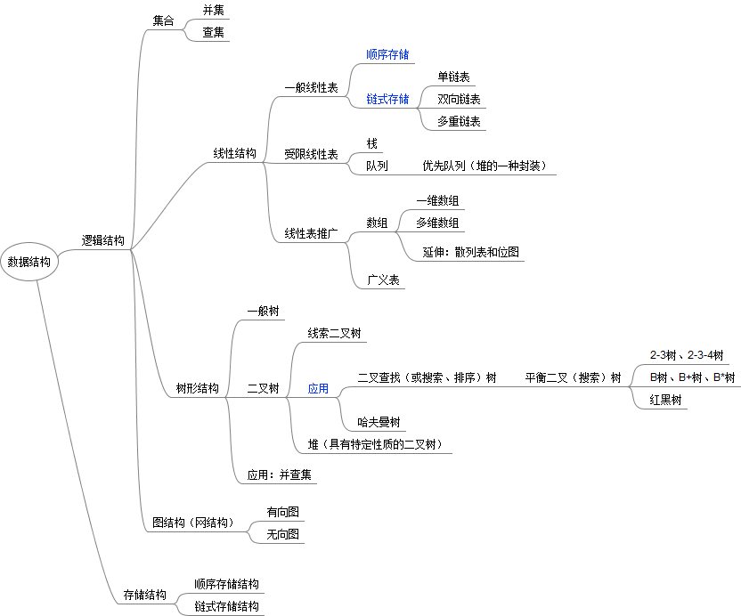

# 线性表

### 数据结构基础



### 基本技能

* null/nil 异常处理
* dummy node 哑巴节点
* 快慢指针
* 对结点进行增、删、改、查等操作
* 翻转链表
* 合并两个链表
* 找到链表的中间节点

### 基础题型

#### [remove-duplicates-from-sorted-list](https://leetcode-cn.com/problems/remove-duplicates-from-sorted-list/)

> 给定一个排序链表，删除所有重复的元素，使得每个元素只出现一次。

```cpp
ListNode* deleteDuplicates(ListNode* head) {
    ListNode *ptr = head;
    //注意访问x.val和x.next得保证x != NULL.
    while(ptr && ptr->next){
        if(ptr->next->val == ptr->val){
            ptr->next = ptr->next->next;
        }else{
            ptr = ptr->next;
        }
    }
    return head;
}
```

#### [remove-duplicates-from-sorted-list-ii](https://leetcode-cn.com/problems/remove-duplicates-from-sorted-list-ii/)

> 给定一个排序链表，删除所有含有重复数字的节点，只保留原始链表中 没有重复出现的数字。
>
> 思路：链表头可能会出现重复的元素，这时候需要修改链表头。

```cpp
ListNode* deleteDuplicates(ListNode* head) {
    if(!head)
        return head;
    //设置一个哑结点，可以避免边界问题
    ListNode *prev_ptr = new ListNode(head->val + 1);
    prev_ptr->next = head;
    head = prev_ptr;
    //后续的处理逻辑是ptr往前遍历，ptr指向的结点只有两种情况，删和不删，
    //删的情况交给prev_ptr去处理
    ListNode *ptr = head;
    while(ptr && ptr->next){
        if(ptr->next->val == ptr->val){
            while(ptr->next && ptr->val == ptr->next->val){
                ptr = ptr->next;
            }
            prev_ptr->next = ptr->next;
        }
        ptr = ptr->next;
        //做判断的目的是看ptr和prev_ptr中间有没有保留的元素，有的话及时跳过
        if(prev_ptr->next && prev_ptr->next->next == ptr){
            prev_ptr = prev_ptr->next;
        }
    }

    prev_ptr = head;
    head = head->next;
    delete prev_ptr;
    return head;
}
```

#### [reverse-linked-list](https://leetcode-cn.com/problems/reverse-linked-list/)

> 反转一个链表

```cpp
ListNode* reverseList(ListNode* head) {
    if(!(head && head->next))
        return head;
    ListNode *tmpHead = head->next;
    ListNode *newHead = head;
    newHead->next = NULL;
    while(tmpHead){
        ListNode *ptr = tmpHead;
        tmpHead = tmpHead->next;
        ptr->next = newHead;
        newHead = ptr;
    }
    head = newHead;
    return head;
}
```

